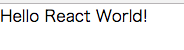

# React について

React は Facebook 製の View ライブラリです。  
React を導入することで、より高い保守性とパフォーマンスを得ることができます。  
React には以下の特徴があります。

-   仮想 DOM
-   コンポーネント指向
-   JSX
-   単方向データフロー、prop、state ( <a href="./#/HowToReact2">次ページ</a>で解説）

## 仮想 DOM について

React での DOM ( Document Object Model ) 出力方式は、一旦仮想 DOM に出力したものと実際の DOM とを比較し、差分のみ再描画する方式です。  
DOM 出力は量が多いほど、描画内容の更新時、クライアントへの負荷が大きくなります。  
その為、従来の方式では、円滑なページ表示を行う独自のロジックを組み、最低限の DOM の更新にとどめる必要がありました。  
React では意識することなく最もローコストな描画が可能です。

## コンポーネント指向について

React ではコンポーネントベースで開発を行います。  
コンポーネントとは UI 部品のことで、このページにも見られる、リンク、ヘッダー、フッター、段落…などなど様々な部品に分けることができます。  
Web 開発基盤でもコンポーネントを提供しています。  
コンポーネントベースには再利用しやすいこと、責務を分離できること、テストが容易になることなどの利点があります。

## JSX

JSX は XML のようにタグを書いていく JavaScript のシンタックスです。  
これを使うことによって js ファイルに直接 DOM を書くことができます。  
下記ソースコードの return() 内の部分がこれにあたります。

```jsx
class TestComponent extends React.Component {
    render() {
        return <div>Hello, React World!</div>;
    }
}
```

JSX を使わない記法もありますが、可読性・生産性の面から JSX を使って書くことを強く推奨します。  
以降サンプルコードの DOM 部分は全て JSX で記載します。

# 開発環境について

React では最終的にファイルを 1 つに統合することが望まれます。  
また、JSX をコンパイルして通常の JavaScript に変換するため、開発環境を構築する必要があります。  
以下の作業は必ず、開発環境の構築を終えてから行って下さい。

# チュートリアル

サンプルの含まれていないソースを元にチュートリアルを行います。  
このチュートリアルの目的は React を理解することであって、本格的な画面を作成することではありません。

Web 開発基盤では ES2015 書式を推奨しているため、このドキュメント全体は ES2015 で書かれています。ES2015 についての構文解説も載せていきますので参考にして下さい。  
ES2015 書式についてはブラウザによって対応していない関数などもあります。そのため Web 開発基盤では ES2015 書式で書かれたコードを ES5 書式 に変換することでクロスブラウザを実現しています。  
この機能は Web 開発基盤の提供するオートビルド機能に含まれています。

余談ですが、ES5 の次の JavaScript（ES2015）のことを ES6 と呼ぶのは間違いです。  
ES2015、ES2016、ES2017・・・という名称で統一されており、ES2015 が正式名称になります。

# 成果物

このチュートリアルでは、画面に文字を出力することを目指します。

<br>


## 開発環境の始動

### ソースコードの入手

tortoiseGit を使用して、テンプレートをリポジトリからクローンしてローカルに作成します。  
bash や shell で Git を使用している場合は、下記の URL を git clone してください。

```
https://github.com/NipponJimuki/HowToReact.git
```

### ソースコードの確認

index.html を確認します。

```html
<!DOCTYPE html>
<html lang="ja">
<head>
    <meta charset="utf-8">
    <meta name="viewport" content="width=device-width,initial-scale=1">
    <meta http-equiv="X-UA-Compatible" content="IE=edge"/>
    <title>Sample App</title>
    <link rel="stylesheet" type="text/css" href="http://yui.yahooapis.com/3.18.1/build/cssreset/cssreset-min.css">
    <link href='http://fonts.googleapis.com/css?family=Roboto:400,300,500' rel='stylesheet' type='text/css'>
    <link href="https://fonts.googleapis.com/icon?family=Material+Icons" rel="stylesheet">
    <link rel="stylesheet" href="https://maxcdn.bootstrapcdn.com/bootstrap/latest/css/bootstrap.min.css">
    <basename href="/" />
</head>
<body>
    <div id="content"></div>
    <script type="text/javascript" src="build/bundle.js"></script>
</body>
</html>
```

この時

```html
<div id="content"></div>
```

という箇所を覚えていてください。

<br>
次にオートビルド機能を作動させます。  
コマンドプロンプトでプロジェクトルートに移動してから、下記コマンドを実行してください。

```
yarn start
```

これによって localhost:3334 が自動的に開かれます。  
以上で開発環境の始動は完了です。

今後も開発を始める際には、
`yarn start` を実行してから作業を行うようにしてください。

## コンポーネントの作成

まずは src/App.js を完成させます。 App.js に下記コードを入力し、保存してください。

```jsx
// App.js
import React, { Component } from 'react';
import ReactDOM from 'react-dom';

class App extends Component {
    render() {
        return <div>Hello React World!</div>;
    }
}

ReactDOM.render(<App />, document.getElementById('content'));
```

ブラウザで開かれた localhost:3334 を確認して、「Hello React World!」と表示されていれば成功です。

## 構文解説

### import 文

```jsx
// App.js
import React, { Component } from 'react';
import ReactDOM from 'react-dom';
```

この import 文は、モジュール読み出しの構文です。  
従来の JS 開発環境では下記のような複数ファイルを依存の関係する順番で、読み出す構成が用いられていました。

```
<script src="jquery"></script>
<script src="moduleA"></script>
<script src="moduleB"></script>
```

一方、モダンな JS 開発環境では複数のファイルがある場合、それらを 1 つのファイルとして纏めて扱うことができます。

```
<script src="bundle.js"></script>
```

これにより、他のファイルが必要であれば import 文を記載することで、そのファイルを使うことができます。  
App.js では、React が必要なため、react, react-dom を読み込んでいます。

#### 構文の使い方

node_module を読み込む場合。

```js
import 変数名 from モジュール名
```

モジュール名は node_module をルートとしています。

独自で作成したファイルを読み込む場合は、下記のように相対パスで記載します。

```js
import test from './TestApp';
```

### 分割代入

分割代入は、{}（オブジェクトリテラル）というシンタックスを使った記法で、オブジェクトのプロパティを変数として展開します。  
分割代入を使用すると下記のように表現できます。

```js
const obj = {
    a:10,
    b:10;
};
const { b } = obj;
console.log(b);  // 10
console.log(a);  // undefined
```

従来の書き方では下記のようになります。

```jsx
var obj = {
    a:10,
    b:10;
};
var b = obj.b;
console.log(b);  // 10
console.log(a);  // undefined
```

分割代入記法はモジュールの import にも使えます。  
従来の記法の require にと比べて格段に使いやすくなっています。

例えば App.js では下記のように書かれています。

```jsx
import React, { Component } from 'react';
```

これによって、下記のようにコンポーネントを作成することができます。

Before

```jsx
import React from 'react';

class App extends React.Component
```

After

```jsx
import React, { Component } from 'react';

class App extends Component
```

After では、分割代入を用いて React オブジェクトの中の Component というプロパティを展開しています。  
これにより、Component という名称で React.Component クラスを記述できるようになります。

指定したプロパティ名を独自の名称で利用したい場合、

```
import React, { Component as originalName } from 'react';
```

とすることで Component というプロパティ名を、originalName という変数名として宣言することができます。

#### import と require

モジュールのインポートで、require というものもあります。  
Node.js や webpack のコードを書く際には、この require を使います。
import は ESModules という規格で、require は CommonJS という規格になりますので、
そもそも別の構文となっています。  
やっていることは、指定したモジュールの呼び出しであることには変わりませんが、参照解決や取得処理などに若干の違いはあります。

#### 構文の使い方

```
const { プロパティ名（オブジェクト変数が持っている） } = オブジェクト変数;
import { プロパティ名（モジュールが持っている） } from 'モジュール名';
```

変数名を、オブジェクト変数の持つプロパティ名ではなく、独自に定義したい場合は、下記のように記述します。

```
const { プロパティ名（オブジェクト変数が持っている） : 変更したい名称 } = オブジェクト変数;
import { プロパティ名（モジュールが持っている） as 変更したい名称 } from 'モジュール名';
```

### クラス構文

次にクラスの構文です。クラス構文は下記のように使用します（constructor は省略可能）。

```jsx
class クラス名 {
    constructor() {
        // 初期化処理
    }
    // メソッド等を記載
}
```

class 内で constructor という名前で関数を宣言すると、このクラスの初期化処理として実行されます。

クラスを継承するためには extends を使用し下記のようにコーディングします。

```jsx
class クラス名 extends 継承クラス名 {
    constructor() {
        console.log('Hello World!');
    }
    //  メソッド等を記載
}
```

この例の場合、初期化処理として console.log が 1 回実行されます。  
extends は prototype 継承の新しい書き方と捉えてもらえれば、大丈夫です。  
説明が長くなるため prototype との比較は省略します。

App.js では下記のようにコーディングしています。

```jsx
class App extends Component {
    render() {
        return <div>Hello React World!</div>;
    }
}
```

Component(React.Component)を継承して App クラスを作っています。  
App.js では、constructor は省略され、render メソッドのみが定義されています。  
React では、React.Component を継承して作られたクラスが React Component と呼ばれます。
その他、stateless functional component と呼ばれる JSX を返すだけの関数コンポーネントも存在します。

#### render メソッド

React Component（React.Component を継承した クラス）で最も重要なメソッドは render メソッドです。  
これは独自に定義しているメソッドではなく React.Component で定義されているメソッドです。  
このメソッド内ではドキュメント情報を持った node (画面に描画出来る要素）を返すことができ、ここで return されている node がこのクラスの DOM 出力結果になります。

```jsx
<App />
```

```jsx
<div>Hello React World!</div>
```

上記の 2 つのコードでは、DOM 出力時の表示結果が等しくなります。  
また、React コンポーネントには以下のルールがあります。

1. Component 名の先頭は必ず大文字であること
2. render メソッドを必ず定義すること
3. render メソッドで返す node は必ずひとまとめにすること※

※ React は必ず 1 つの component(node) で返すように定義されており、複数の component を返そうとするとエラーになります。

3 つめのルールについては以下のようになります。  
case: ダメな例

```jsx
render(){
    return (
        <div>
            A
        </div>
        <div>
            B
        </div>
    );
}
```

上記の例では div が並行して並んでいるためエラーになります。そこで下記のように 1 つにまとめて return しなければなりません。  
case: 良い例

```jsx
render(){
    return (
        <div>
            <div>
                A
            </div>
            <div>
                B
            </div>
        </div>
    );
}
```

### react-dom.render について

App.js のコードの最後の一行には下記のコードがあります。

```jsx
ReactDOM.render(<App />, document.getElementById('content'));
```

このコードによってルートコンポーネントと html を結びつけます。  
上記の場合、html に記載された

```
<div id="content"></div>
```

を、コンポーネント `<App />` で上書きする働きをします。

```jsx
ReactDOM.render(
    ReactElement(Component),
    DOMElement [function callback],
);
```

ReactDOM.render は上記のような引数を受け取ります。
