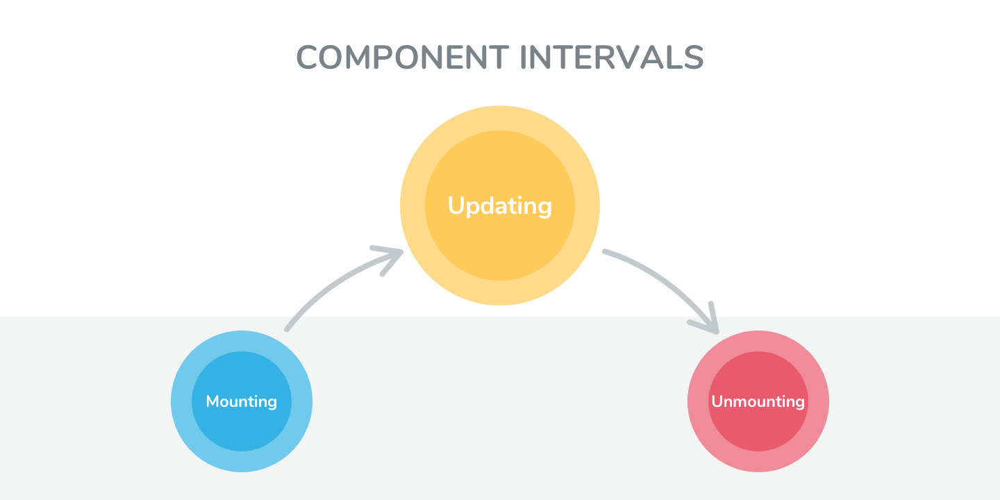

# ライフサイクルメソッドについて

先ほどまで、「render という React がもっているメソッドがあります」という説明程度にとどめていましたが、render はライフサイクルメソッドと呼ばれるメソッドの 1 つです。  
ライフサイクルメソッドには呼ばれる順番・役割がそれぞれ決まっています。

<br />



<br /> 
上記画像のように、ライフサイクルメソッドは 3つに大別されており、これにエラーハンドリングを追加した

-   Mounting
-   Updating
-   Unmounting
-   Error Handling

の 4 つがライフサイクルメソッドとなります。  
ライフサイクルメソッドを理解し、使いこなすことによってより精巧な React Component を作ることができます。

## Mounting

インスタンス化時（初めてレンダリングされるとき）には

```
         constructor
              |
             V
    getDerivedStateFromProps(static)
              |
             V
           render
              |
             V
      componentDidMount
```

の順に実行されます。  
なお、constructor は React のライフサイクルメソッドの 1 つではなく、
JavaScript のクラス構文で最初に実行されるメソッドなので説明を省略します。

### getDerivedStateFromProps

render メソッドの手前で実行されるメソッドです。
最初のマウント時と、更新時に render メソッドの前で呼び出されます。  
第一引数に次の props 、第二引数に前の state を受け取り、props を元に state を更新する場合に使い、
返却された値がそのまま現在の state にマージされます。  
変更がある場合は変更後の state を、変更がない場合は null を返します。

```js
static getDerivedStateFromProps(nextProps, prevState){
    // 受け取る name が変更された時、isTouched を初期化する
    if (nextProps.name !== prevState.name)
        return {
            name: nextProps.name,
            isTouched: false,
        }
    }
    return null;
}
```

static なメソッドなので、this コンテキストを使って自身の情報（props, state)を知ることができませんので注意してください。  
前回の props を参照したい場合は、state に持たせることで参照することができるようになります。

### render

ライフサイクルメソッドのなかで唯一省略不可能なメソッドです。また、render メソッドは必ず return を返す必要があります。return するものが JSX の場合、必ずそれらは単一のタグに含める必要があります。

### componenDidMount

コンポーネントがレンダリングされた後に呼び出されるメソッドです。  
constructor や getDeriverdStateFromProps と違い、DOM の情報にアクセスすることができます。  
DOM 情報を使った処理や、API 通信を行う処理はここに記述することが望ましいです。

```js
async componentDidMount() {
    // API通信をして、データを取得している
    const res = await fetch('http://hogehoge');
    const data = await res.json();
    this.setState({ data, success: true });
}
```

※ 補足
オブジェクトリテラル {} を使用する際に、変数名とプロパティ名が同じ場合、プロパティ名の記述を省略することができます。

```js
const height = 100;
const width = 100;
//  以下のオブジェクト作成方法の結果は同じ
const obj1 = { height, width };
const obj2 = {
    height: height,
    width: width,
};
```

## Updating

再描画（コンポーネントが更新される）時には

```
getDerivedStateFromProps(static)
              |
             V
shouldComponentUpdate
              |
             V
          render
              |
             V
getSnapshotBeforeUpdate
              |
             V
componentDidUpdate
```

の順に実行されます。

### 再描画が発生するポイント

前回の <a href="./HowToReact3">HowToReact3</a> で説明したように setState によって、state が変更された時、また親から渡されている props が変更された時コンポーネントの再描画が行われます。  
具体的には、

```
     App
    /   ＼
   HRC   HRC2※   <- 再描画が発生
  /           |   ＼   ＼
 granC  AA※ BB※ CC※
  |                      |
 gGranC         DD※
```

上記の図のように HRC2 でコンポーネントの再描画が行われた場合、そのイベントはそれ以降の子孫にも伝播します。上記の図では※がついているコンポーネント全てにおいて、再描画が行われています。

### shouldComponentUpdate

名前の通り、コンポーネントを更新すべきかを判断するために使用します。このメソッドはパフォーマンス改善のために使用します。  
shouldComponentUpdate では引数に、新しい props と state を受け取ることができます。  
非常に重要な点として、このメソッドは真偽値を必ず返さないといけません。  
true を返すと再描画され、false を返すと後続のレンダーフェーズがスキップされます。  
もし**新しい props や state がコンポーネントに受け渡されていても、false を返すと再描画されません **ので、気をつけてください。  
このメソッドを使う場合は、更新すべきタイミングを判断する条件について真剣に検討してください。

```js
shouldComponentUpdate(nextProps, nextState){
    if(nexProps.id === this.props.id) return false;
    return true;
}
```

上記の場合では、新しい props.id と古い props.id を比較し、一致した場合は再描画を行わないということをしています。  
そのため、このように記述したコンポーネントでは、props.id 以外の props や state の値をどのように更新しても、 props.id が同じである限り、そのコンポーネントの再描画は行われません。

#### 補足：PureComponent 使用時

shouldComponentUpdate を 利用する際に、注意することがあります。
React コンポーネントを 定義する時、通常は

`class testComponent extends React.Component`

のように React.Component を継承します。React v15.3 から PureComponent が実装され、

`class testPureComponent extends React.PureComponent`

とすることで React コンポーネントを PureComponent として定義することができます。
PureComponent は shouldComponentUpdate のデフォルトの挙動を変更した Component で、既存の props と新しい props、既存の state と新しい state それぞれで浅い比較を行い、true か false を返すようになっています。  
PureComponent でも shouldComponentUpdate の定義は可能で、 PureComponent が定義している shouldComponentUpdate を上書きします。（その場合、浅い比較は行われず、shouldComponentUpdate で定義した比較になるので注意してください）

### getSnapshotBeforeUpdate

DOM が更新される直前に呼ばれるメソッドで、更新前に必ず一度だけ呼び出されます。
後述の componentDidUpdate とセットで使用します。  
更新前の props, state を引数として受け取ることができ、更新前の DOM 情報を取ってくることもできます。  
このメソッドで返却した値は componentDidUpdate の第 3 引数（snapshot）で受け取ることができます。

```js
getSnapshotBeforeUpdate(prevProps, prevState) {
    if (prevProps.unauthorized !== this.props.unauthorized) {
        return this.props.unauthorized ? '不正なアクセスです!!' : 'hello world!!';
    }
    return null;
}

componentDidUpdate(prevProps, prevState, snapshot) {
    if (snapshot !== null) {
        this.setState({
            dialog: { open: true, title: snapshot },
        });
    }
}
```

state で開閉を制御されたダイアログが埋め込まれたコンポーネントがあったとします。  
上記の例では、このコンポーネントは unauthroized という props を常に監視し、
true であれば ダイアログ の state を変更してメッセージを表示するということをしています。

### componentDidUpdate

コンポーネントがアップデートされた直後に実行されるメソッドです。  
更新前の props, state を引数として受け取ることができます。
そして、前述した getSnapshotBeforeUpdate で返却された値を snapshot で受け取ることができます。  
更新直後の DOM 操作や、props, state の変化をトリガーにした API 通信を書く際に使います。
componentDidMount に似ていますが、ここで setState を行うと再び再描画時のライフサイクルメソッドが実行されるためループしないような条件をつける必要があります。

```js
componentDidUpdate(prevProps, prevState, snapshot) {
    if (this.divRef.current) {
        // div 要素の DOM を取得し、高さと幅を state にセットしています
        const { height, width } = this.divRef.current.getBoundingClientRect();
        this.setState({ height, width });
    }
}
```

## Unmounting

コンポーネントが DOM から取り除かれる直前に componentWillUnmount というメソッドが実行されます。

### componentWillUnmount

コンポーネントの後始末をここに書きます。  
後始末とは、

-   登録したイベントリスナーの削除（addEventListner）
-   タイマーの削除（setInterval）
-   API 通信の停止（fetch）

などが挙げられます。

```js
constructor() {
    this.timeid = window.setInterval(() => {
        console.log('test');
    }, 1000);
}

componentWillUnmount(){
    window.clearInterval(this.timeid);
}
```

## Error Handling

React v16 から新たに、エラー発生時に呼び出されるライフサイクルメソッドが追加されました。
このライフサイクルメソッドを定義することで、tyr-catch のようにコンポーネント内でエラーハンドリングを行うことができます。

-   getDerivedStateFromError
-   componentDidCatch

の 2 つがあります。  
このメソッドを定義したコンポーネントを Error Boundary と呼びます。
どこに Error Boundary を配置するかは要件次第になります。  
アプリケーションのルートに 1 つ配置したり、 画面の一部 が壊れても他の部分は利用可能な状態を保ちたい場合は、Error Boundary をコンポーネントの粒度毎に配置します。

### getDerivedStateFromError

React v16.6 から新しく追加されたライフサイクルメソッドです。  
子コンポーネント以下の階層でエラーがスローされた後に呼び出され、それをメソッドの引数として受け取ることができます。  
また、エラーがあるのならばコンポーネントに知らせるための値を返す必要があります。
返却された値は state としてマージされます。  
 子コンポーネント以下の階層で エラーが発生した場合、エラーメッセージをレンダリングするなどの使い方があります。

```jsx
class ErrorBoundary extends React.Component {
    constructor(props) {
        super(props);
        this.state = { hasError: false };
    }

    static getDerivedStateFromError(error) {
        //  エラー表示切り替えの更新
        return { hasError: true };
    }

    render() {
        if (this.state.hasError) {
            return <h1>ページ内でエラーが発生しました</h1>;
        }
        return this.props.children;
    }
}
```

static なメソッドなので、this コンテキストを使った自身の情報を参照することはできません。  
this コンテキストを使う場合は、次節の componentDidCatch を使います。

### componentDidCatch

getDerivedStateFromError 同様、子コンポーネントで起きたエラーが発生された後に呼び出されます。  
error と info という 2 つの引数を受け取ることができます。

-   error : スローされた JavaScript エラー
-   info : どのコンポーネントでエラーが起きたかを示す componentStack オブジェクト

getDerivedStateFromError とは違い、componentDidCatch は componentStack を受け取ることができるので、  
エラーロギングをこのメソッドを定義したコンポーネントで行うことができます。

```js
static getDerivedStateFromError(error) {
    return { hasError: true };
  }

componentDidCatch(error, info) {
    /* componentStackの例 */
    //   in ComponentThatThrows (created by App)
    //   in ErrorBoundary (created by App)
    //   in div (created by App)
    //   in App
    console.error(info.componentStack)
}
```

#### 補足：componentDidCatch での setState

React v16.6 以前は componentDidCatch でエラーの状態を

`this.setState({ hasError })`

で更新をしていました。  
**getDerivedStateFromError が実装されたことで、こちらの書き方は将来のリリースで非推奨になることが決定しています。**

#### 補足：注意

getDerivedStateFromError も componentDidCatch も子コンポーネントのエラーをキャッチすることはできますが、
自コンポーネント、および親コンポーネントで起きたエラーをキャッチすることはできませんので注意してください。

また、Error Boundary を配置することで、エラーハンドリングはできるようになりますが、必ずしもエラーを捕捉できるとは限りません。  
React v16 からエラー時の挙動が変更され、Error Boundary でも キャッチできないエラー（Uncaught Error）が 発生した場合、コンポーネントツリー 全体が削除（Unmounting）されるようになっています。

# Legacy Lifecycle Methods

最後に非推奨となったライフサイクルメソッドを紹介します。  
以下、紹介するライフサイクルメソッドは全て非推奨であり、**React v17 で完全削除されることが決定**しています。  
もし、まだアプリケーション内で使っているのならば、早急に移行することをおすすめします。  
<a href="https://github.com/reactjs/react-codemod#rename-unsafe-lifecycles" target="blank">こちら</a>を使うと移行を自動化することができます。

|      ライフサイクルメソッド      |          移行先          |
| :------------------------------: | :----------------------: |
|    UNSAFE_componentWillMount     |       constructor        |
| UNSAFE_componentWillReceiveProps | getDerivedStateFromProps |
|    UNSAFE_componentWillUpdate    | getSnapshotBeforeUpdate  |
