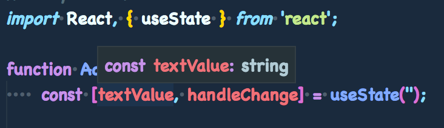
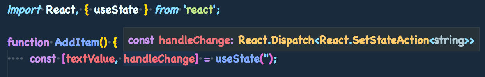

## 入力値管理アプリケーションを Hooks で実装

HowToRedux で実装した Todo もどきを Hooks の機能を使って実装しなおしていきます。  
ここでは、HowToRedux3 の成果物を少し発展したものを作成します。  
具体的には以下の機能を追加します。

-   レンダリング時にテキストフィールドにフォーカスする
-   Enter キー押下でテキストを送信する
-   送信後、テキストフィールドを初期化する

### ソースコードの入手

bash や shell で、下記の URL を git clone してください。

```
https://github.com/NipponJimuki/HowToReactHooks.git
```

master ブランチがこのチュートリアルで使用するテンプレートになっています。

## ソースコードの確認

Git Clone してきたソースコードを確認します。  
src 直下の App.tsx を開きます。

```tsx
// src/App.tsx
import React from 'react';
import ReactDom from 'react-dom';

// DOM出力
ReactDom.render(<div>Hello React Hooks</div>, document.getElementById('content'));
```

yarn install 後に

`yarn start`

コマンドを打つことで、App.tsx が読み込まれて画面に「Hello React Hooks」が表示されることを確認してください。  
src/components 直下にコードを作成していきます。  
フォルダ分け、export は既に行なっておりますので、早速コードを作成していきます。

### AddItem を読み込むようにする

今回は AddItem のみを変更していきます。  
App.tsx が AddItem コンポーネントを読み込むように変更します。

```tsx
// App.tsx
import React from 'react';
import ReactDom from 'react-dom';
import { AddItem } from './components';

// DOM出力
ReactDom.render(<AddItem />, document.getElementById('content'));
```

## AddItem を確認する

現在のソースコードを確認します。

```tsx
// components/AddItem.tsx
import React from 'react';

function AddItem() {
    return <div />;
}

export default AddItem;
```

今までは 関数コンポーネント（SFC）はアロー関数を使って作成していましたが、Function Component では function 式で記述していきます。

### 入力値を保存できるようにする

まずは、テキストフィールドに入力されたテキストを state としてコンポーネントが保持できるように変更を加えていきます。

```tsx
// components/AddItem.tsx
import React, { useState } from 'react';

function AddItem() {
    const [textValue, handleChange] = useState('');

    const _onHandleChange = (e: React.ChangeEvent<HTMLInputElement>) =>
        handleChange(e.target.value);

    return (
        <>
            <input type="text" onChange={_onHandleChange} value={textValue} />
            <div>{textValue}</div>
        </>
    );
}

export default AddItem;
```

これで入力値をコンポーネントで管理でき、画面に表示できるようになります。

`const [textValue, handleChange] = useState('');`

State の作成は useState という API を使い、第 1 引数に空文字を与えていますので、空文字で初期化がされます。  
handleChange は関数で、このメソッドに値を渡すことで textValue の値を変更することができます。

onChange への渡し方ですが、

```tsx
onChange={e => handleChange(e.target.value)}
```

とした場合、毎回新しい関数が作成されて再レンダリングが走ってしまうので

```
const _onHandleChange = (e: React.ChangeEvent<HTMLInputElement>) => handleChange(e.target.value);
```

このように別定義をしています。  
これは、従来の Class Component でいうイベントハンドラメソッドの bind と同等のことをしています。

#### useState で取得した値の型

従来の Class Component では State の型定義を先に行い、型引数として渡していました。  
Function Component では、特にこちらで型の定義を行う必要はありません（特殊な状態管理を行う場合はこの限りではない）。




上記画像から見てわかるように、useState は与えられた初期値の型を元に型推論を行なっており、
返却される dispatch 関数も、受け付ける型は string のみとなっています。  
useState に number 型の値を渡せば number 型で、boolean 型であれば boolean 型の state と dispatch 関数を得られます。

### 入力値を複数保存できるようにする

続いて、追加ボタンを作成します。
追加ボタンで押された時のテキストを状態として保存していき、簡易的な Todo アプリにします。

```tsx
// components/AddItem.tsx
import React, { useState } from 'react';

function AddItem() {
    const [textValue, handleChange] = useState('');
    const [items, addItem] = useState(['']);

    const _onHandleChange = (e: React.ChangeEvent<HTMLInputElement>) =>
        handleChange(e.target.value);
    const _onAddItem = (item: string) => () => addItem(prevItems => [...prevItems, item]);

    return (
        <>
            <input type="text" onChange={_onHandleChange} value={textValue} />
            <button onClick={_onAddItem(textValue)}>追加</button>
            {items.join('/')}
        </>
    );
}

export default AddItem;
```

新たに items という state を作成し、string 型のみ受け付ける配列として定義しました。  
テキストを入力し、追加ボタンを押すことでスラッシュで区切られたテキストデータを表示できるようになりました。

```tsx
addItem(prevItems => [...prevItems, item]);
```

items の追加には、コールバック形式の state 更新を行なっています。  
prevItems には、現在の items の内容が保存されており、最後尾に新しいテキストを追加ということを行なっています。

## 追加の機能を実装していく

これまでのコードで、HowToRedux3 と同じものができました。  
ここからは HowToRedux3 に追加の機能を実装していきます。

### マウント時にテキストフィールドにフォーカスさせる

このアプリケーションでは、テキストを入力することが主な操作になります。  
なので、コンポーネントの読み込みが完了（componentDidMount）した時に、テキストフィールドに予めフォーカスをさせておきます。

```tsx
// components/AddItem.tsx
import React, { useState, useRef, useEffect } from 'react';

function AddItem() {
    const [textValue, handleChange] = useState('');
    const [items, addItem] = useState(['']);
    const inputEl = useRef<HTMLInputElement>(null);

    useEffect(() => {
        if (inputEl.current) {
            inputEl.current.focus();
        }
    }, []);

    const _onHandleChange = (e: React.ChangeEvent<HTMLInputElement>) =>
        handleChange(e.target.value);
    const _onAddItem = () => addItem(prevItems => [...prevItems, textValue]);

    return (
        <>
            <input ref={inputEl} type="text" onChange={_onHandleChange} value={textValue} />
            <button onClick={_onAddItem}>追加</button>
            {items.join('/')}
        </>
    );
}

export default AddItem;
```

これでマウント時にテキストフィールドにフォーカスが当てられるようになりました。  
ここで使った Hooks は

-   useRef : テキストフィールドの ref を作成する
-   useEffect : マウント時にテキストフィールドにフォーカスさせる

useRef と useEffect の 2 つになります。

```tsx
const inputEl = useRef<HTMLInputElement>(null);
```

ref オブジェクトの型ですが、useRef に型引数で HTMLInputElement を直接指定します。  
型引数を渡さないと、どのタイプのエレメントかを判別できないので型の不一致が起きてしまいます。

#### useEffect の欠点

HowToReactHooks1 でも解説しましたが、useEffect は非同期で呼ばれます。  
そのため、DOM オブジェクトにアクセスできるようになる前に処理が走った時は、フォーカスされません。

<br>
useEffect ではなく、useLayoutEffect を使うと確実にフォーカスさせることができます。

### Enter キー押下で送信させる

続いて、Enter キーが押された時のテキストを追加ボタンが押された時と同じ処理をさせるようにイベント処理を紐づけます。

```tsx
// components/AddItem/index.tsx
import React, { useState, useRef, useEffect } from 'react';

function AddItem() {
    const [items, addItem] = useState(['']);
    const [textValue, handleChange] = useState('');
    const inputEl = useRef<HTMLInputElement>(null);

    useEffect(() => {
        const onEnter = (e: KeyboardEvent) => {
            if (e.keyCode === 13 && inputEl.current) {
                const item = inputEl.current.value;
                addItem(prevItems => [...prevItems, item]);
                handleChange('');
            }
        };

        window.addEventListener('keydown', onEnter);
        if (inputEl.current) {
            inputEl.current.focus();
        }
        return () => {
            window.removeEventListener('keydown', onEnter);
        };
    }, []);

    const _onHandleChange = (e: React.ChangeEvent<HTMLInputElement>) =>
        handleChange(e.target.value);
    const _onAddItem = () => addItem(prevItems => [...prevItems, textValue]);

    return (
        <>
            <input ref={inputEl} type="text" onChange={_onHandleChange} value={textValue} />
            <button onClick={_onAddItem}>追加</button>
            {items.join('/')}
        </>
    );
}

export default AddItem;
```

useEffect の中に onEnter という関数を作成し、これを keydown イベントが発生した際の処理に紐付けます。  
Enter キー（キーコード = 13）が押された時、テキストフィールドの ref から入力値を取得して、それを addItem に渡しています。  
その後、handleChange 関数に空文字を与えることで初期化を行うようにしました。

ref ではなく、state の textValue を利用することもできますが、現状のコードでは常に空文字が渡されてしまいます。  
useEffect のメモライズキーに textValue を渡すと、state での更新を行うことができるようになります。  
しかし、その場合入力される度に useEffect の処理が実行されてしまうため、あまり良い実装とは言えません。

こういう場合は、useCallback を使って実装するのが 1 番良いコードになりますが、useCallback は後のツアーで使いますので省略します。  
HowToReactHooks2 での作業は以上となります。
