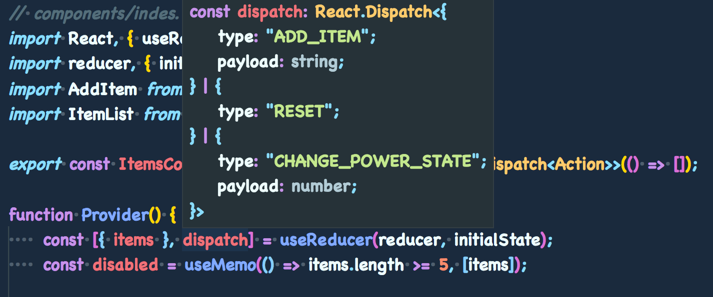
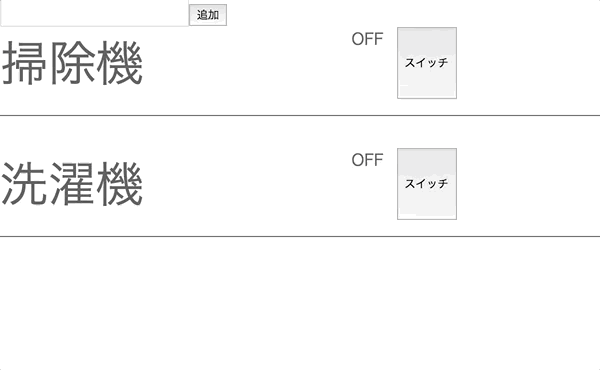

## 家電アプリのリファクタリング

ここでは、完成した家電管理アプリケーションのリファクタリングを実施していきます。  
具体的には以下の 2 つのことを行います。

-   不要なレンダリングを抑制する
-   dispatch 関数のバケツリレーを無くす

なお、挙動の変更は行いません（変更されないようにします）。

### パフォーマンスチューニング

今までの Class Component では shouldComponentUpdate メソッドを使って、
props と state を比較してレンダリングするかどうかを判断していました。  
Function Component にはライフサイクルメソッドがないので、これを使うことはできません。

Hooks では useCallback と useMemo の 2 つの API、そして React.memo 関数を使って同様のことを実現します。

具体的には、下層の子コンポーネントを React.memo でメモコンポーネント化して、  
親コンポーネントでメモライズ化した props を渡すことでレンダリングを抑制していきます。

### props のバケツリレー

useReducer で作成した dispatch 関数は、対象のイベントハンドラがあるコンポーネントに辿り着くまで props でバケツリレーを行わないといけません。  
React, Redux で構築したアプリケーションでは、これを Redux の Container（正確には connect 関数） で Store と Action の振り分けを行なうことで回避していました。

Hooks では useContext という API と createContext を使うことで、Redux の connect と同等の操作を実現することができます。

## Provider の作成

props の振り分けを行うルートとなる Provider を作成します。  
components/index.tsx を以下のように編集します。

```tsx
// components/index.tsx
import React, { useReducer, useMemo } from 'react';
import reducer, { initialState, Action } from './reducer';
import AddItem from './AddItem';
import ItemList from './ItemList';

export const ItemsContext = React.createContext<React.Dispatch<Action>>(() => []);

function Provider() {
    const [{ items }, dispatch] = useReducer(reducer, initialState);
    const disabled = useMemo(() => items.length >= 5, [items]);

    return (
        <ItemsContext.Provider value={dispatch}>
            <AddItem disabled={disabled} />
            <ItemList items={items} />
        </ItemsContext.Provider>
    );
}

export default Provider;
```

ItemsContext という名前で Provider を作成しました。  
Provider には管理したい state や action（dispatch）を value の中に渡してあげることで、Redux の store のように値を管理することができます。  
今回は dispatch 関数のみを Provider に管理し、items や disabled は個別にコンポーネントに渡すようにしています。

### ContextAPI の型付けと初期値

createContext で作成するコンテキストの型は、Provider の value に渡す型と同一のものにする必要があります。  
ここでは useReducer の dispatch 関数を管理しています。  
useReducer から返却される dispatch の型は



このようになっています。  
React.Dispatch の中のオブジェクトの型は reducer が期待しているアクションと同じになっているので

`<React.Dispatch<Action>>`

とすることで同じ型定義を作成することができます。  
次に、createContext の初期値ですが、こちらは React.Dispatch
の型に合致するように createContext の初期値を第 1 引数に渡してあげないといけません。  
React.Dispatch の型は

```ts
type Dispatch<A> = (value: A) => void;
```

と定義されています。  
型引数に渡された A（Action）型の value を引数として受け取る関数になっていますので、

`() => []`

と空の配列を返却する関数を初期値として渡しています。  
関数が実行された後に返却される配列は reducer から返却される initialState に合わせています（null や空文字でもエラーは出ません）。

## AddItem の編集

dispatch 関数を context から取得するように AddItem を下記のように編集します。

```tsx
// components/AddItem/index.tsx
import React, { useState, useEffect, useRef, useContext } from 'react';
import { addItem, reset } from '../reducer';
import { ItemsContenxt } from '../';

type Props = {
    disabled: boolean;
};

function AddItem({ disabled }: Props) {
    const dispatch = useContext(ItemsContenxt);
    const [textValue, handleChange] = useState('');
    const inputEl = useRef<HTMLInputElement>(null);
    const resetText = () => handleChange('');
    const onHandleChange = (e: React.ChangeEvent<HTMLInputElement>) => handleChange(e.target.value);
    const onAddItem = () => {
        if (textValue) {
            dispatch(addItem(textValue));
            handleChange('');
        }
    };
    const onReset = () => dispatch(reset());

    useEffect(() => {
        const onEnter = (e: KeyboardEvent) => {
            if (e.keyCode === 13 && inputEl.current) {
                const item = inputEl.current.value;
                if (item) {
                    dispatch(addItem(item));
                    resetText();
                }
            }
        };

        window.addEventListener('keydown', onEnter);
        if (inputEl.current) {
            inputEl.current.focus();
        }
        return () => {
            reset();
            window.removeEventListener('keydown', onEnter);
        };
    }, [disabled]);

    return (
        <>
            <input
                ref={inputEl}
                type="text"
                onChange={onHandleChange}
                disabled={disabled}
                value={textValue}
            />
            <button onClick={onAddItem} disabled={disabled}>
                追加
            </button>
            {disabled && <button onClick={onReset}>リセット</button>}
        </>
    );
}

export default React.memo(AddItem);
```

変更点は以下の通りです。

-   Props の型定義を disabled のみにした
-   props 経由で実行していた dispatch を useContext で直接実行するようにした
-   メモコンポーネント化

メモコンポーネント化したことで、AddItem は disabled の値に変更があった時だけ再レンダリングされるようになりました。

#### useContext の使い方

useContext は createContext で作成したコンテキストを引数として渡すことで Provider に設定した value を受け取ることができます。

```tsx
import { ItemsContenxt } from '../';

const dispatch = useContext(ItemsContenxt);
```

そのため、元となるコンテキストを export しておく必要があるので注意してください。

## ItemList の編集

続いて家電を一覧表示する ItemList を編集していきます。

### 構成の変更

現在、ItemList は

1. 家電名
1. 電源の状態
1. 電源を切り替えるスイッチ

の 3 つのものを表示しています。  
現状の構成では不要なレンダリングが行われてしまいます。

家電が追加された際に、map 処理からコンポーネントの DOM 要素の追加処理が走りますが、
家電名を表示する Item コンポーネントは値（name）の変更にかかわらず、毎回新しいコンポーネントとして作成されてしまいます。  
そこで、別コンポーネントに切り出して

-   index.tsx
-   Item.tsx
-   DisplayState.tsx
-   Switch.tsx

の 4 つのコンポーネントに分割して、これらをメモ化してレンダリングの抑制を行います。

### 末端コンポーネントのメモ化

先に、末端となる子コンポーネントを全てメモコンポーネントに変更していきます。

```tsx
// components/ItemList/Item.tsx
import React from 'react';
import styled from 'styled-components';

type Props = {
    children: string;
};

function Item({ children }: Props) {
    return <Container>{children}</Container>;
}

const Container = styled.div`
    font-size: 3rem;
    width: 50%;
    text-overflow: ellipsis;
    white-space: nowrap;
`;
Container.displayName = 'Container';

export default React.memo(Item);
```

```tsx
// components/ItemList/DisplayState.tsx
import React from 'react';

type Props = {
    power: boolean;
};

const styles = {
    width: '45px',
};

function DisplayState({ power }: Props) {
    return <div style={styles}>{power ? 'ON' : 'OFF'}</div>;
}

export default React.memo(DisplayState);
```

```tsx
// components/ItemList/Switch.tsx
import React from 'react';

type Props = {
    onClick: () => void;
};

function Switch({ onClick }: Props) {
    return <button onClick={onClick}>スイッチ</button>;
}

export default React.memo(Switch, () => true);
```

### ルートとなる ItemList の編集

最後にルートとなる index.tsx を編集します。

```tsx
// components/ItemList/index.tsx
import React, { useCallback, useContext } from 'react';
import styled from 'styled-components';
import Item from './Item';
import Switch from './Switch';
import DisplayState from './DisplayState';
import { ItemsContenxt } from '../';
import { changePowerState, ItemProps } from '../reducer';

type Props = {
    items: ItemProps[];
};

function ItemList({ items }: Props) {
    const dispatch = useContext(ItemsContenxt);
    const onClick = useCallback((index: number) => () => dispatch(changePowerState(index)), []);

    return (
        <>
            {items.map(({ id, name, power }, index) => (
                <List key={id}>
                    <Item>{name}</Item>
                    <DisplayState power={power} />
                    <Switch onClick={onClick(index)} />
                </List>
            ))}
        </>
    );
}

const List = styled.div`
    width: 100%;
    display: flex;
    flex-wrap: nowrap;
    color: rgb(100, 100, 100);
    padding-bottom: 1rem;
    margin-bottom: 2rem;
    border-bottom: 1px solid rgb(100, 100, 100);
`;
List.displayName = 'List';

export default ItemList;
```

変更点は以下の通りです。

-   props の型定義を items のみにした
-   家電名を表示する Item コンポーネントをインポート
-   props 経由で受け取っていた Action（changePowerState）を useContext から取得
-   Action を useCallback を使ってメモライズ化

HowToTypeScript からコードに大きな変更は入っていませんが、onClick を useCallback を使ってメモライズ化するようにしました。  
useCallback はメモライズ化した関数を返す Hooks の API で、メモライズキーに空の配列を指定しています。  
これで、新しい家電が追加されたとしても、関数の再作成を抑制することができます。

### ループ処理内の useCallback によるメモライズ化

配列で管理されているようなリストに対して、onClick や onChange を指定することがしばしばあります。  
その際、リストの**何番目の**要素を指定する時に、もっぱら添字（index）を使います。

```tsx
const onClick = (index) => () => dispatcher(index)

const nodeList = props.items.map((item, index) => (
    <button key={index} onClick={props.onClick(index)}>{item}<div>
));
```

上記コードの場合、props.items に変更が入る度に props.onClick 関数が再作成され、再レンダリングされてしまいます。  
これを抑制するためには、onClick に渡す props をメモライズ化する必要があります。  
通常であれば

```ts
const onClick = useCallback(() => dispatcher(), []);
```

useCallback の第 2 引数に空の配列を渡すことでメモライズ化することができます。  
この例にならって

```ts
const onClick = useCallback((index: number) => () => dispatcher(index), []);
```

とすることで、onClick 関数の再作成を防ぎます。  
なお、index が渡された段階で`() => dispacter(index)`と新しい関数が作成されているので、子のコンポーネントでは違う値として評価されてしまいますので注意してください。  
この場合、子コンポーネント側で`React.memo`関数 を使って再レンダリングを防ぎます。  
上記の Switch.tsx 内では

```ts
React.memo(Switch, () => true);
```

onClick を一度受け取った段階で再レンダリングする必要がなくなるので、true を渡して再レンダリングを防いでいます。  
他にも再レンダリングを防ぐ方法はあります（idnex を props で渡して、React.memo 関数の第 2 引数で評価する）

なお、関数でない index を参照する何らかの変数をメモライズ化したい場合は useMemo を使います。

以上の作業で、コンポーネントの不要なレンダリングを避けることができました。  
Function Component でのレンダリング制御は既存の shouldComponentUpdate に比べると短いコード量ですみます。  
if 文を使った比較制御が必要ない分、更新されなくなったなどのバグに陥ることも少なくなります。  
ただし、React.memo は浅い比較でレンダリング制御をしているのでネストされたオブジェクトや連想配列の比較にはむかないので注意してください。  
また、比較コストは決して軽くはないので常にレンダリングした方が早い場合もあります。  
**全てのコンポーネントをメモ化すると、かえって遅くなってしまうケースもあります。**  
これは React.PureComponent でも同様のことが言えます。

## React.memo の第 2 引数について

今回は React.memo と Hooks の useMemo と useCallback を使って実装しました。  
Hooks を使わずとも React.memo だけでもレンダリングの抑制を行うことは可能で、この時に第 2 引数を使います。  
また、浅い比較では抑制することができないネストされたオブジェクトなども、こちらで対応することができます。

React.memo の第 2 引数を使って DisplayState を使うと下記のようになります。

```tsx
// components/ItemList/DisplayState.tsx
import React from 'react';

type Props = {
    power: boolean;
};

function DisplayState({ power }: Props) {
    return <div style={{ width: '45px' }}>{power ? 'ON' : 'OFF'}</div>;
}

export default React.memo(
    DisplayState,
    (prevProps, nextProps) => prevProps.power === nextProps.power,
);
```

第 2 引数はコールバック関数で、第 1 引数に前回の props、次回の props を受け取ることができます。  
shouldComponentUpdate とは逆で、コールバック関数が**false を返した時に再レンダリング**されるようになっているので注意してください。  
このコードだと、電源の真偽値が等価の場合はレンダリングしないということをやっています。

## 終わりに

リファクタリング実施後のコードでは、下記のようにレンダリングがハイライトされるようになりました。



電源ボタンを押した際に全ての要素が再レンダリングされていましたが、電源の ON/OFF を示す要素のみハイライトされるように変わりました。  
テキストフィールドもハイライトはされていますが、Function Component 内にまで処理は届いておらずレンダリングはされていません。

新しく導入された React Hooks を使うことで、ミニマムな状態管理と props のバケツリレーを回避することができました。  
実際には、ContextAPI や React.memo など Hooks 以外の機能も使いましたが、Redux に頼ることなくアプリケーションを構築することができました。  
Custom Hooks や useImperativeMethods など使っていない機能もあります。  
まだまだ発展途上の機能なのでプロダクションでの実装は推奨しませんが、段階的に移行していくことを強くオススメします。
