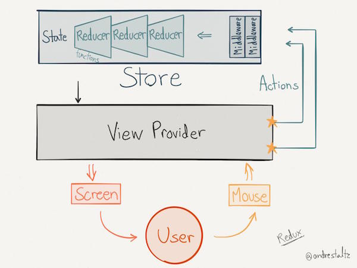

# Redux 概要

この項では Redux の概要を解説します。

## React の欠点

React を使うことでコンポーネントベースで開発でき、再利用しやすくなり、部品ごとの責務を分離することができます。また、分かりやすいデータフローのためどの箇所で問題が発生したかを調べることは非常に容易となります。

一方でアーキテクチャを持たない React では、View とロジックを分離できていません。  
そのため以下の場合では、HRC2 の持つ状態（state）を granC で変更したい場合は変更箇所やデータ（props)の取り回しが複雑になります。

```
     App
    /   ＼                     |
   HRC   HRC2           | data-flow
  /           |＼ ＼         V
 granC  AA  BB CC
  |
 gGranC
```

この場合 2 つの選択肢があります。

### 1 state をルートに移動させる

state の箇所を変更します。

Before

```
     App
    /   ＼
   HRC   HRC2(state)
    /         |＼ ＼
 granC  AA  BB CC
  |
gGranC
```

After

```
     App(state)
    /   ＼
   HRC   HRC2(props)
   /          |＼ ＼
 granC  AA  BB CC
  |
 gGranC
```

上記のように HRC2 が持っていた state を App に渡し、その state を App から HRC2 に props として受け渡すように変更します。
次に下記のように変更する必要があります。

```
                             App(state)
                           /   ＼
                         HRC   HRC2(props)
setState            |           |＼ ＼
(App->HRC->) granC  AA BB CC
                           |
                         gGranC
```

この場合では、App のもつ state を変更する関数を HRC に props をとして渡し、HRC はその props を何をするわけでもなくそのまま granC に props として渡しています。
こうすることで、

```
gracCにて関数実行 -> Appのstate変更 -> HRC2のprops変更
```

というフローを辿り granC におけるアクションで HRC2 に変更を伝えることができます。

今後のアプリケーションの仕様変更などを想定すると、全ての state を App が管理することが望ましい形となってしまいます。  
そうした場合 App が持つ state の量は膨大となり、state は props として子コンポーネントから、次の孫コンポーネントへ渡されていきます。  
これを props のバケツリレーといい、データフローが複雑になる要因となります。

### 2 state の更新をアクションで制御する

```
     App
    /   ＼
   HRC   HRC2(state)
  /            |＼ ＼
 granC   AA BB CC
  |
 gGranC
```

この解決策では HRC2 の持つ state はあくまで HRC2 にとどめ、granC でのアクションでイベントを発火させることを試みます。
そのためにはまず、HRC2 で granC が発火するイベントに対応するイベントリスナーを登録します。そして、HRC2 がイベントを感知した場合、HRC2 の state を変更するようにコーティングを行います。

このような方法でも granC におけるアクションで HRC2 を変更させることもできます。
こちらの方がよりシンプルで、わかりやすい考え方です。

一方でデータフローという点では秩序が乱れてしまっています。

## 解決策

そこで、React では Flux というアーキテクチャが推奨されています。Web 開発基盤では、Redux を Flux アーキテクチャを実装するためのフレームワークとして推奨しています。  
Redux は Flux アーキテクチャの思想を取り入れたアーキテクチャ（厳密には Flux アーキテクチャとはことなる）を提供してくれる最も人気の Flux アーキテクチャフレームワークです。  
Redux の他に MobX というアーキテクチャもありますが、2018 年 11 月現在、Redux が事実上のデファクトスタンダードとなっています。

### Redux におけるアーキテクチャ

下記の図が Redux におけるアーキテクチャーを示している図です。これは、アーキテクチャのもつデータフローを示しています。



## Redux の概念

### View プロバイダー

View プロバイダーとはいわゆる View です。View は HowToReact でも作ってきたコンポーネントのことを指します。最大の違いは Redux とリンクしている点です。

### Actions

Action の役割は、ブラウザ上で発生したイベントなどを Middleware、あるいは Reducer に伝えることにあります。いわばディスパッチャーとしての役割を担います。  
また、View は Action を発行することができます。この Action を通して、ロジックが実行されることになります。
つまり、Redux では Action を用いることで、View とロジックを分離することができます。

### MiddleWare

Middleware とはいわゆるドメイン層です。Action を受けることで何かしらのロジックを実行します。ベーシックな Redux アプリケーションでは Middleware がロジックを全て担います。
また、Middleware では、受け取った Action を Reducer へ渡す、再び Action を発行する、store からデータを取得するなど、ロジックの処理に特化した記述が行えます。

例えば

-   View から Action に乗せて渡されたデータを加工して Reducer へ渡す。
-   WebApi をコールする
-   新たに Action を発行して、他の複数の Reducer へ Action を送る

    などを行うことができます。

### Store

state の集合体の事を指します。  
Redux アプリケーションでは、1 つの store の中にアプリケーション内で管理される全ての状態が格納されています。
複数の store を持つことも可能ですが、アンチパターンとされています。  
`store.getState()` の形で state にアクセスすることが出来ます。

### state

状態のこと。この state はコンポーネントへ props として渡されます。そのため、ツリー構造特有の制約に悩む事なく、View は全ての state にアクセスすることができます。

### Reducer

state を変更する唯一の手段。
Action を受けて新しい state を生成し、Store に登録することが Reducer の役割になります。

### フローのまとめ

Redux での基本的なデータフローは下記のようになります。

```
1.View は Store から必要な値を受け取る
2.ユーザーの操作などによってイベントが発火する
3.View は Action を発行する
4.Middleware が受け取った Action に対してなんらかの処理を施す（省略可、ここで終わる場合も）
5.Reducer が受け取った Action を元に Store の state を更新する
6.View は Store から必要な値を受け取る
……以下ループ
```

という流れになります。

### Component と Container

React と Redux を組み合わせる場合、React(Component) は View を担当します。ここまでは今まで通りです。  
Container は React(Component) を Redux につなぐ担当をします。  
これらはそれぞれ以下のように呼ばれています。

|                   名称                   |                                       説明                                        |
| :--------------------------------------: | :-------------------------------------------------------------------------------: |
| Presentational Component(Dumb Component) | Redux と接続していないコンポーネント。Container Component から props を受け取る。 |
|   Container Component(Smart Component)   |  Redux と接続しているコンポーネント。store にアクセスでき、action を発行できる。  |

Container では Component に必要な state や action を props として渡すことができます。
このとき、全ての state をコンポーネントに渡すこともできますが、必要な分だけ渡すことが望ましいです。
全ての state を渡すとコンポーネントは props の反応に敏感になり、不要な更新処理が走ってしまいます。
