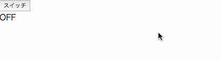
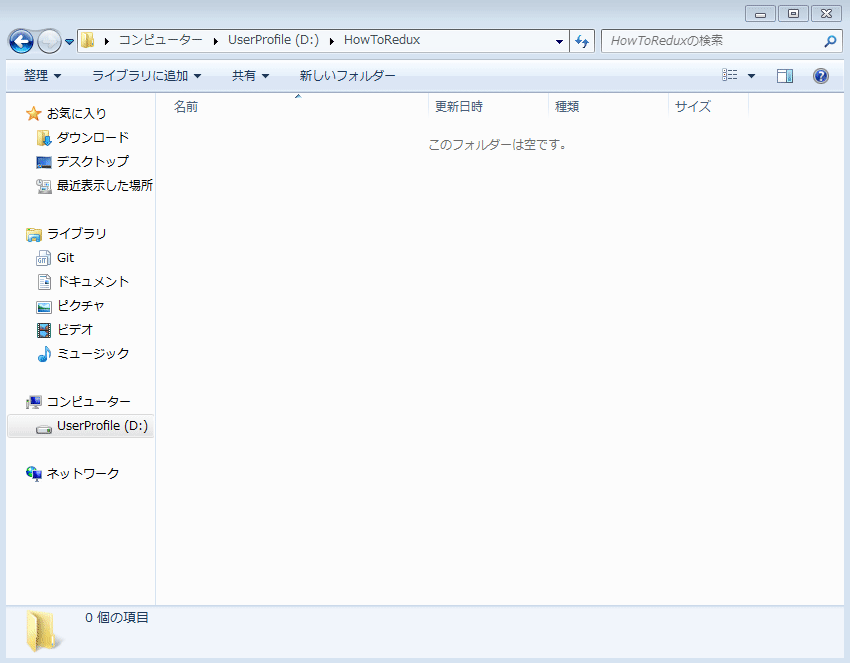

# Redux を実装する

Redux の仕組みをコーディングを介して解説します。
このページでは、ボタンを押すと on と off が切り替わるアプリケーションを作成します。

フォルダ階層

```
root/
  ├ ...etc(node_module, webpack.config.jsなど。。。)
  ├ src/
  │  ├ actions
  │  ├ components
  │  ├ containers
  │  ├ middlewares
  │  ├ reducers
  │  └ App.js
  │
  └ index.html
```

以上のようなフォルダ構成を作成します。

# 成果物



### ソースコードの入手

tortoiseGit を使用して、テンプレートをリポジトリからクローンしてローカルに作成します。  
bash や shell で Git を使用している場合は、下記の URL を git clone してください。

```
https://github.com/NipponJimuki/HowToRedux.git
```

<br>
作業を開始するディレクトリ上で右クリックして Git Clone を押します。
チュートリアルを始めるに当たってこちらのリポジトリを作業フォルダにクローンして開始してください。  
master ブランチがこのチュートリアルで使用するテンプレートになっています。

<br>


<br>

# Component を作成する

Smart Component, Dumb Component を作成します。

## ベースとなる React Component の作成

components フォルダ配下に Main.js を作成します。
ここで、読み込んでいる Switch, DisplayState はまだ存在しませんが、後ほど作成します。

```jsx
// components/Main.js
import React, { Component } from 'react';
import PropTypes from 'prop-types';
import Switch from './Switch';
import DisplayState from './DisplayState';

class Main extends Component {
    static defaultProps = {
        changePowerStateAction() {},
        powerState: false,
    };

    render() {
        const { changePowerStateAction, powerState } = this.props;
        return (
            <div>
                <Switch onClick={changePowerStateAction} />
                <DisplayState power={powerState} />
            </div>
        );
    }
}
Main.propTypes = {
    changePowerStateAction: PropTypes.func,
    powerState: PropTypes.bool,
};

export default Main;
```

ここで想定している props は下記の値を想定しています。

-   changePowerStateAction： DisplayState の"on"と"off"をきりかえるアクション
-   powerState： DisplayState に渡される power が"on"か"off"かを示す真偽値

src/components/index.js を編集します。

```js
// components/index.js
export { default as Main } from './Main';
```

この index.js はフォルダを示すパスが指定された際に読み込まれるファイルになります。
こうすることによって、わざわざファイル名までパスに含めなくても下記のように import できるようになります。

<br>
例）

```js
import { Main } from '../components';
```

### export default について

`export { default as Main } from './Main';`という記述ですが、先ほど作成したコンポーネントでは最下部に`export default Main`と書いています。  
export default とは言葉の意味通り、ファイルをインポートする際にデフォルトでインポートされるものになります。  
export 構文自体は複数書くことができますが、default export できるのは 1 ファイルにつき 1 つのみです。

読み込み元の index.js では**export default に指定されたものを"Main"という名前で export する**ということを行なっています。

## Container の作成（Smart Component 化）

コンテナーを作成して先ほど作った Main コンポーネントを Smart Component にします。

Container では Store から state を取得する関数（mapStateToProps)と  
Action を Dispatch する関数（mapDispatchToProps)の 2 つを定義します。

containers 配下に Main.js を作成します。

```jsx
// containers/Main.js
import { connect } from 'react-redux';
import { Main } from '../components';
import { changePowerState } from '../actions';

const mapStateToProps = state => ({
    ...state,
});

const mapDispatchToProps = dispatch => ({
    changePowerStateAction() {
        dispatch(changePowerState());
    },
});

export default connect(
    mapStateToProps,
    mapDispatchToProps,
)(Main);
```

connect という関数を使うことで Redux と Main.js が接続されます。  
また、このように関数に引数として React Component を渡された Component を Higher Order Component(HOC)と言います。  
このコードでは以下の 2 つのことを行なっています。

-   mapStateToProps：Store から受け取った 値を全て Main.js に流し込む
-   mapDispatchToProps：changePowerState という Action を changePowerStateAction という props 名で渡す

こうすることで Main では、this.props.changePowerStateAction()で Action を発行できるようになり、this.props.powerState で state にアクセスすることができます。

dispatcher の構文は

```js
dispatch(Actionオブジェクト);
```

です。上記コードでの changePowerState というのは Action を作成し返す関数（Action Creator）です。  
次に index.js を編集します。

```js
// containers/index.js
export Main from './Main';
```

### ...という記法について

mapStateToProps にある `...state` という記述はスプレッドオペレーターという ES2015 から導入された新しい演算子です。  
配列やオブジェクトに対して使うことができ、変数が持っている値をシャローコピーして全てそのまま渡すということをしています。  
**シャローコピーなので、オブジェクトの中のオブジェクトなどは参照渡しになっています**

```js
// 例

const obj = { id: 0, name: 'hoge', age: 22, deep: { value: 'deepCopy' } };
const array = [0, 'hoge', 22];

let newObj = { ...obj, age: 24 };
let newArray = [...array, 'deep'];

newObj.name = 'foo';
newObj.deep.value = 'shallowCopy';
newArray[1] = 'foo';

console.log(obj);           // { id: 0, name: 'hoge', age: 22, deep: { value: 'shallowCopy' } };
console.log(array);         // [0, 'hoge', 22];

console.log(newObj);        // { id: 0, name: 'foo', age: 24 deep: { value: 'shallowCopy' } };
console..log(newArray)      // [0, 'foo', 22, 'deep'];
```

## DumbComponent の作成

次にまだ作成をしていなかった Switch, DisplayState コンポーネントを作成します。これらは Redux と接続せず、props を受けるのみのコンポーネントのため DumbComponent と呼ばれます。

components フォルダ配下に、Switch.js, DisplayState.js を作成します。

```jsx
// components/Switch.js
import React, { Component } from 'react';
import PropTypes from 'prop-types';

class Switch extends Component {
    static defaultProps = {
        onClick() {},
    };

    render() {
        return <button onClick={this.props.onClick}>スイッチ</button>;
    }
}
Switch.propTypes = {
    onClick: PropTypes.func,
};

export default Switch;
```

```jsx
// components/DisplayState.js
import React, { Component } from 'react';
import PropTypes from 'prop-types';

class DisplayState extends Component {
    static defaultProps = {
        power: false,
    };

    render() {
        return <div>{this.props.power ? 'ON' : 'OFF'}</div>;
    }
}
DisplayState.propTypes = {
    power: PropTypes.bool,
};

export default DisplayState;
```

どちらも親の SmartComponent から受け渡された props を使用しているのみです。

# Action を作成する

Action の作成方法はきわめて単純です。
Action で行うことは、type プロパティ（一意な文字列）を含むオブジェクトを返すのみです。

まず、一意な文字列を作成します。src/actions フォルダ直下に actionTypes.js を作成します。

```js
// src/actionTypes.js
export const CHANGE_POWER_STATE = 'CHANGE_POWER_STATE';
```

次に、actions 配下に Main.js を作成します。

```js
// actions/main.js
import { CHANGE_POWER_STATE } from './actionTypes';

export const changePowerState = () => ({
    type: CHANGE_POWER_STATE,
});
```

ここで、type プロパティに含めた一意の文字列は reducer(あるいは middleware)が action を受け取った際に識別するために使用します。  
次に、index.js を作成します。

```js
// actions/index.js
export * from './Main';
```

export \* とすることで Main に含まれる Action がすべて export されます。

# Reducer の作成

次に Reducer を作成します。Reducer で行うことは Action を受け取り、新しい state を返すことです。
Reducers 配下に Main.js を作成します。

```js
// reducers/main.js
import { CHANGE_POWER_STATE } from '../actions/actionTypes';

const initialState = {
    powerState: false,
};

export const changePowerState = (state = initialState, action) => {
    const { type } = action;

    switch (type) {
        case CHANGE_POWER_STATE:
            return {
                ...state,
                powerState: !state.powerState,
            };
        default:
            return state;
    }
};
```

この Reducer の役割は Action を受け取った場合、state.powerState（真偽値）を反転させることです。state が false なら true に、true なら false に変換して返します。

```js
・・・・( state = initialState,  ・・・・
```

上記のような state = initialState という記述は 関数のデフォルト引数で state の初期値を指定する役割を持ちます。

reducer では action のもつ type プロパティを元に action を識別して任意の state を返すようにします。

```js
const { type } = action;

switch (type) {
    case CHANGE_POWER_STATE:
```

最後に今までと同様に index.js を更新します。

```js
// reducers/index.js
export * from './Main';
```

# ルートの編集

App.js を以下のように変更します。

```jsx
import React from 'react';
import { render } from 'react-dom';
import { createStore } from 'redux';
import { Provider } from 'react-redux';
// 追加
import { changePowerState } from './reducers';
import { Main } from './containers';

// 追加
const store = createStore(changePowerState);

// DOM出力
// 変更
render(
    <Provider store={store}>
        <Main />
    </Provider>,
    document.getElementById('content'),
);
```

これによって、Smart Component である Main コンポーネントが読み込まれ、アプリケーションが動作するようになります。

以上でこの章における作業は完了です。

<br>

# Redux のコーディングコスト

React 単体であれば、Component のみ変更すればよかったのに対して、Redux では、Action, Container, Reducer, (Middleware)というファイルも変更する必要があります。
そのため、今回の例のような小規模アプリケーションであれば React 単体で実装したほうがはるかに短い時間で作ることができます。  
一方で、大きなアプリケーションを作る際には React の欠点（props のバケツリレー）があるため、Redux で実装することを推奨します。props の取り回しからは解放され、変更に強く、再利用により強いアプリケーションを作成することができます。  
また、Redux のおかげで、View が完全に独立するため React Native などのネイティブアプリを作成するフレームワークでモバイルアプリ版をリリースしたいとなった時に既存の資産を元にアプリを作ることもできるようになります。
