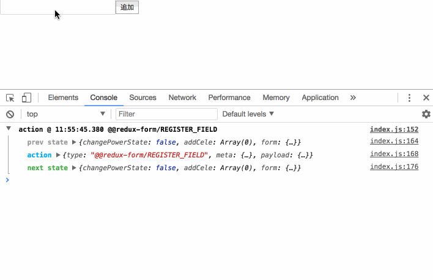

# redux-logger を使用する

このページでは外部パッケージを使って、開発を効率的に進めていく方法を解説します。  
action が発行されると state が変化するというのが Redux における基本的な流れになります。  
開発時には何かと追って行きたいことが多いですがこれを追うためには事細かに console.log を仕込まなければなりません。

<a href='https://github.com/evgenyrodionov/redux-logger' target='_blank'>redux-logger</a> を使用することで、見やすく、なおかつ簡単に追うことが可能になります。

## redux-logger を設定する

redux-logger は Middleware に設定します。
middlewares/index.js を編集し、applyMiddleware に logger を追加します。

```js
// middlewares/index.js
import { applyMiddleware } from 'redux';
import { createLogger } from 'redux-logger';
import changePowerState from './itemList';

const logger = [];
if (process.env.NODE_ENV === 'development') {
    logger.push(createLogger());
}

const middlewares = applyMiddleware(changePowerState, ...logger);

export default middlewares;
```

以上の設定が終わりましたら後は、ブラウザで F12 キーを押下してコンソールを眺めるだけで確認できます。( mac で chrome をお使いの方は「cmd + alt + I」)  
<br>


#### process.env.NODE_ENV について

これは環境変数になります。  
開発サーバ（webpack）が、起動時に

`NODE_ENV = 'development'`

という環境変数を自動付与してくれており、これを利用しております。  
production としてリリースする際には、この NODE_ENV が production という文字列に変わるので、
リリースされた React アプリケーションでは、redux-logger のログが出ないということができます。

# formik を使用する

先ほどのページで行った入力値の管理は非常に手間に感じたかもしれません。入力値を Store で管理させるためには以下の手順を行う必要があります。

-   入力イベントに対して dispatch する関数を用意
-   対応する action を用意
-   対応する reducer を用意
-   一意のイベントキーを設定

1 つテキストフィールドがあるだけでこれだけの準備が必要になります。そのため、入力フォームが多数あるページではとても実装しきれません。
そこで、<a href='https://jaredpalmer.com/formik/docs/overview' target='_blank'>formik</a> を使うことでこれらの問題を解決します。

## formik を設定する

formik はコンポーネントに対して直接設定していきます。  
formik は renderProps と HOC（Higer Order Components）の 2 つの実装方法がありますが、renderProps で実装します。
components/AddItem.js を編集します。

```jsx
// components/AddItem.js
import React from 'react';
import { Formik } from 'formik';
import * as Yup from 'yup';
import PropTypes from 'prop-types';

const AddItem = ({ addItemAction }) => (
    <Formik
        initialValues={{ item: '' }}
        validationSchema={Yup.object().shape({
            item: Yup.string().required('入力必須です'),
        })}
        onSubmit={(values, { resetForm }) => {
            addItemAction(values.item);
            resetForm();
        }}
        render={({ values, errors, touched, handleChange, handleBlur, handleSubmit }) => (
            <form onSubmit={handleSubmit}>
                <input
                    type="text"
                    name="item"
                    value={values.item}
                    onChange={handleChange}
                    onBlur={handleBlur}
                />
                {errors.item && touched.item && <span>{errors.item}</span>}
                <button type="submit">追加</button>
            </form>
        )}
    />
);

AddItem.propTypes = {
    addItemAction: PropTypes.func,
};

export default AddItem;
```

formik は Formik というコンポーネントを提供しており、この Formik に対して props で値を渡すことで設定を行います。
画面に表示する要素は render という props に記述します。
このように、props 経由でレンダリングするものを返すことを renderProps と呼びます。

|      props       |  コールバックの引数   |                      説明                       |
| :--------------: | :-------------------: | :---------------------------------------------: |
|  initialValues   |           -           |             フォームの初期化を行う              |
| validationSchema |           -           | Yup（後述します）による validation の設定を行う |
|     onSubmit     | formValues, formikBag |              submit 時の処理を行う              |
|      render      |      formikProps      |    レンダリングするコンポーネントを記述する     |

### initialValues

この props でフォームの初期化と、コンポーネント内でフォーム入力値を管理するオブジェクトの作成を行います。  
作成されたオブジェクトは values という props で参照することができます。

フォームの初期化をコンポーネントが受け取る props を元に行いたい場合は、
コンポーネント内で直接定義するか、container などで予め設定しておきます。
なお、これは他の Formik が受け取る他の props（validationSchema など）についても同様です。

### validationSchema

Yup を使用して validation をかける際に設定する props になります。  
もし、Yup で設定した項目を満たさない場合、オブジェクトが返却され、errors という props で参照することができます。

### onSubmit

submit となるボタンやアクションをトリガーにして実行される props です。  
主に入力値を引数に Action を発行する、コンポーネントの後始末（フォームリセットやダイアログのクローズ）などを行います。
validation エラーがあった場合、onSubmit の処理は実行されませんので、if 文を挟むことなくスマートに記述できます。

コールバックの引数で受け取ることができる formikBag ですが、この props にはフォームのリセットや一括更新など formik の状態を変更するための様々な Action が入っています。  
ここでは resetForm というフォームのリセットを行うメソッドを実行しています。

### render

レンダリングするコンポーネントを記述する props です。
コールバックで受け取ることができる formikProps は、formik の中で管理されている状態やアクションを全て含んでいます。  
前述した formikBag + formValues 含む formik の状態を持っています。

### formik の props の取得

render の中で受け取っている props は下記の 6 つの通りです。

-   values : formik に登録されたフォームオブジェクト
-   errors : formik に登録されたフォームオブジェクトのエラー
-   touched: formik に登録されたフォームにフォーカスが当たったかどうかの真偽値
-   handleChange : フォーム入力値を変更するメソッド
-   handleBlur : フォーカスされた挙動を検知するメソッド
-   handleSubmit : フォーム送信メソッド

この 5 つを利用しています。

### input エレメントとの連携

input と formik を接続するには、
value 属性にフォームオブジェクトのキー値と
name 属性に紐付けたいフォームオブジェクトのキー名を name 属性に与えます。

```jsx
<input type="text" name="item" value={values.item} onChange={handleChange} onBlur={handleBlur} />
```

handleChange メソッドを渡すことで、入力値の変更を監視してくれます。
handleBlur はエラーをオブジェクトへの反映を行わせるために渡しています。

### Yup について

formik は validation を設定することをできますが、Yup というモジュールを使うことで
簡単に validaton をかけることができます。
公式でも validation には Yup を推奨しています。

```js
Yup.object().shape({
    item: Yup.string().required('入力必須です'),
}),
```

ここでは item キーに

1. 文字列型で
1. 入力必須項目である

という validation をかけています。  
もし、何も入力せずに追加ボタンを押すと

```js
errors = {
    item: '入力必須です',
};
```

という値がセットされます。

#### HOC での実装

HOC での実装パターンも紹介します。

```jsx
// components/AddItem.js
import React, { Component } from 'react';
import { withFormik } from 'formik';
import * as Yup from 'yup';
import PropTypes from 'prop-types';

class AddItem extends Component {
    static defaultProps = {
        textChangeAction() {},
        addItemAction() {},
        textValue: '',
    };

    render() {
        const { values, errors, touched, handleChange, handleBlur, handleSubmit } = this.props;
        return (
            <form onSubmit={handleSubmit}>
                <input
                    type="text"
                    name="item"
                    onChange={handleChange}
                    onBlur={handleBlur}
                    value={values.item}
                />
                {errors.item && touched.item && <span>{errors.item}</span>}
                <button type="submit">追加</button>
            </form>
        );
    }
}
TextField.propTypes = {
    addItemAction: PropTypes.func,
    values: PropTypes.shape({
        item: PropTypes.string,
    }),
    errors: PropTypes.shape({
        item: PropTypes.string,
    }),
    touched: PropTypes.shape({
        item: PropTypes.boolean,
    }),
    handleChange: PropTypes.func,
    handleBlur: PropTypes.func,
    handleSubmit: PropTypes.func,
};
export default withFormik({
    mapPropsToValues: () => ({
        item: '',
    }),
    validationSchema: () =>
        Yup.object().shape({
            item: Yup.string().required('入力必須です'),
        }),
    handleSubmit: (values, { props, resetForm }) => {
        const { addItemAction } = props;
        addItemAction(addedItems);
        resetForm();
    },
    displayName: 'itemForm',
})(AddItem);
```

renderProps と違い、HOC ではコンポーネントのどこからでも formik の props に対して直接アクセスすることができます。  
formik の設定は下記のように export default 時に設定をします。

```js
export default withFormik({
    mapPropsToValues: () => ({
        item: '',
    }),
    validationSchema: () =>
        Yup.object().shape({
            item: Yup.string().required('入力必須です'),
        }),
    handleSubmit: (values, { props, resetForm }) => {
        const { items, addItemAction } = props;
        const addedItems = [
            ...items,
            {
                id: `item-index-of-${items.length}`,
                name: values.item,
                power: false,
            },
        ];
        addItemAction(addedItems);
        resetForm();
    },
    displayName: 'itemForm',
})(AddItem);
```

withFormik 関数は様々なプロパティを設定することができ、ここで設定しているのは以下の 4 つです。

|   プロパティ名   |   コールバックの引数    | Formik との対応  |                説明                |
| :--------------: | :---------------------: | :--------------: | :--------------------------------: |
| mapPropsToValues |         (props)         |  initialValues   |       フォームの初期化を行う       |
| validationSchema |         (props)         | validationSchema | Yup による validation の設定を行う |
|   handleSubmit   | (formValues, formikBag) |     onSubmit     |       submit 時の処理を行う        |
|   displayName    |          なし           |        -         |         入力フォームの名前         |

props は、コンポーネントが受け取る props を指しています。

### renderProps と HOC

2 つの実装パターンを紹介しましたが、基本的にどちらを使っても同じことができます。  
好きな方で実装すればいいという見解が今まで多かったですが、renderProps の方が好ましいです。

React Hooks の登場で、recompose という HOC を簡単に作ることができるモジュールの新規開発が打ち切りになりました。  
公式でも HOC はわかりづらくしてしまうと言及しています。  
なので、formik に限らず HOC ではなく renderProps で実装した方が好ましいと言えます。

ただし、パフォーマンスチューニングやイベントをトリガーにしたフォーム変更や API 通信を行なった上でのフォームの実装は
HOC の方が素直に書くことができます。  
これらは shouldComponentUpdate や getSnapshotBeforeUpdate などの React のライフサイクルメソッド時にも formik
の props にアクセスできる点で、より精密な実装に向いています。

formik は、基本的に renderProps で実装して、より複雑な処理を行いたい場合は HOC で実装することをおすすめします。
