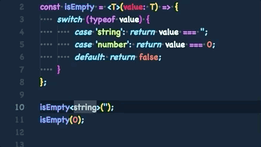

## TypeScript について

TypeScript は AltJS（代替 JavaScript 言語）に含まれる 言語の 1 つです。  
マイクロソフトが開発した、オープンソースのプログラミング言語であり、
現在も頻繁にリリースとアップデートされており、2 ヶ月に 1 度のペースでリリースが行われています。
バージョンは執筆時点（2018 年 11 月 7 日）で 3.1.6 です。

<br />
公式ドキュメントは<a href='https://www.typescriptlang.org/docs/home.html' target='_blank'>こちら</a>になります。  
上記サイトを<a href='http://js.studio-kingdom.com/typescript/' target='_blank'>日本語訳したサイト</a>もあります。

<br />
TypeScript は一言で表せば、型のある JavaScript になります。  
拡張子は「.ts」で、JSXを扱う場合は「.tsx」となります。  
主な特徴として以下のような点があげられます。

-   JavaScript と完全互換性がある（ts ファイルから js ファイルを読み込むことができる）
-   トランスパイラー（Babel）を必要とせずとも ESNext が使える
-   型定義ファイルを自作できる
-   最終的に吐き出されるコードは全て JavaScript

また、VSCode も TypeScript で作られており、他のエディターに比べてとても型予測やエディターの静的チェックに優れています。
Linter を用いずとも、TypeScript であればデフォルトである程度の静的チェックを行なってくれます。

## JavaScript の型について

JavaScript にも string や number などの型（プリミティブ型）は存在しています。  
しかし、それらは変数宣言時に指定するわけでもなく、JavaScript エンジンが実行時に
推測をして型を付与（型推論）しています。

```js
const str = 'string';
const num = 0;

console.log(typeof str); // string
console.log(typeof num); // number
```

このように、変数に代入された値によって型が自動的に決まります。  
また、string => number や string => object などのように型変換（暗黙の型変換）も自由に行うことができます。  
これをメリットととるかデメリットととるかはエンジニアによりけりですが、
大規模アプリの開発などではデメリットの方が目立つ印象はあります。

## JavaScript の型一覧

ES2015 以前は 5 つでしたが、ES2015 で 1 つ追加され、現在 6 つのプリミティブ型があります。

|    型     |        例        | 説明                                           |
| :-------: | :--------------: | :--------------------------------------------- |
|  String   | 'string', 'hoge' | 文字列であることを示す型                       |
|  Number   |      0, NaN      | 数値であることを示す型                         |
|  Boolean  |   true, false    | true, false であるかの真偽値を示す型           |
| Undefined |    undefined     | 定義してあるがデータが入っていないことを示す型 |
|   Null    |       null       | 未定義であることを示す型                       |
|  Symbol   | Symbol('string') | それ自身とのみ等しくなる型                     |

以上がプリミティブ型となるもので、これ以外のものは全てオブジェクト型に含まれます（オブジェクト型自体はプリミティブ型ではありません）。  
今までの HowToReact, HowToRedux などでは配列やオブジェクト、クラスなどをよく使っていましたが、
これらは全てオブジェクト型に含まれます。

#### null 型を扱う際の注意

JavaScript における null の扱いについて補足説明をします。  
先ほど、null は プリミティブ型である Null と紹介しましたが、実際にこれをコード上で確認することはできません。

```js
const value = null;

console.log(typeof value); // object
```

value という変数を定義して null を代入しましたが、console で確認するとオブジェクト型と出力されます。  
**これは ECMAScript のバグで、null は object として扱われます。**

# TypeScript の基本構文

TypeScript の型は、Java や C#と似ています。

```ts
const str: string = 'string';
const num: number = 0;
const nonType = 'nonType'; // 型推論でstring型と解釈される

const fault: string = 0; // Type '0' is not assignable to type 'string'.

type Fruits = 'Banana' | 'Apple' | 'Orange'; // stringの'Banana', 'Apple', 'Orange'のみを許容するデータ型
const fruits: Fruits[] = ['Banana', 'Apple', 'Orange']; // 'Banana', 'Apple', 'Orange'のみを入れられる配列
```

これが TypeScript の基本的なコーディングになります。

`[変数名]: [型]`

で宣言する変数に型をつけることができます。
また、データ型に別名をつけることもでき、それをそのまま型として利用することもできます。

他の静的型付け言語と違い、動的型付け言語である JavaScript の表現をカバーするために
とても柔軟な型システムがあります。

<br />
-   Union Type
-   Never Type
-   Generics
-   Conditional Types

<br />
他にもたくさんあり、これらの機能を全て使いこなすのは難しいですが、習熟すれば
JavaScript のメリットを壊すことなく、堅牢なコードを書くことができます。

ここでは基本の型のみ解説を行い、詳しい型システムの解説は行いません。  
それらはツアーで適宜解説を行なっていきます。

## 基本の型

TypeScript でコーディングしていく上で、基本となる型を紹介します。

### String

文字列の型です。  
ES2015 で追加されたテンプレートリテラルを使うこともでき、埋込式に指定された変数は文字列型に型変換されます。

```ts
const hello: string = 'world';

const num: number = 0;
const world: string = `hello ${num}`; // 'hello 0'
```

### Number

数値の型です。  
0〜9 の値や、浮動小数点数やバイナリーが数値型として扱われます。
当然ですが、シングルクォートやバッククォートで囲われた数値は文字列型なので数値型として扱われることはありません。  
また、NaN（非数）や Infinity（無限大）などの特殊表現も数値型として扱われます。

```ts
const num10: number = 10;
const hex: number = 0xf00d;

// エラーにはならない
const nan: number = NaN;
const Infinity: number = Infinity;
```

### Boolean

真偽値の型です。
Boolean 型に含まれるのは true / false の二値のみとなります。

```ts
const truthy: boolean = true;
const falsy: boolean = false;
```

### Any

何でも許容する型です。  
JavaScript との互換性を持たせる結果、生まれた型で、一切の型チェックが行われなくなります。  
サードパーティのライブラリやどの型が来るかわからないケースで使います。

```ts
let anything: any = 'string';

anything = 0;
anything.hoge = 'hoge';
```

違う型へのキャストや、存在しないプロパティへのアクセスも可能になりますが、
逆に型の恩恵を受けられなくなるので、あまり使わないようにしましょう。

### Unknown

その名の通り、不明な型です。  
Any 型の代替で、どの型がくるかわからないようなシーンで使います。

```ts
(async () => {
    const data: unknown = await execAPI();
    return data;
})();
```

Any 型と違い、Unknown 型から他の型にキャストしたり、存在しないプロパティへのアクセスはできません。

### Never

決して発生することのない型です。  
never 型は常に例外をスローする型で、決して値を返さない関数の戻り値や未到達コードの判定に利用したりします。  
Redux の middleware や reducer で利用します。

```ts
const throwError(): never => {
    throw new Error('error')
}
```

### Array

JavaScript ではオブジェクト型として扱われる配列ですが、TypeScript では基本型の 1 つとして存在しています。  
2 通りの書き方があります。

```ts
const stringArray: string[] = ['type', 'script'];
const numberArray: Array<number> = [0, 1, 2, 3, 4, 5];
```

どちらも同じ配列型である記法ですが、前者の［]をつける方での片付けを推奨します。  
Array\<number\>という記法ですが、これはジェネリクス型配列と呼ばれるもので、
<>の中に型を渡すことで型定義を行っています。  
この時、number は型引数と呼ばれます。

### Object

オブジェクトの型宣言は複数の書き方がありますが、代表的なものを紹介します。

```ts
type User = {
    id: string;
    profile: {
        firstName: string;
        lastName: string;
        age: number;
        hobby?: string[]; // ?をつけるとnull, undefinedを許容する
    };
};
interface UserProfile {
    id: string;
    profile: {
        firstName: string;
        lastName: string;
        age: number;
        hobby?: string[];
    };
}

const user1: User = {
    id: '0001',
    profile: {
        firstName: 'foo',
        lastName: 'bar',
        age: 24,
        hobby: ['baseball', 'soccer'],
    },
};
const user2: UserProfile = {
    id: '0002',
    profile: {
        firstName: 'bar',
        lastName: 'foo',
        age: 24,
    },
};
```

このように、Type Alias や interface で別に型宣言を行います。  
Type Alias と interface は概ね同じことを表現できますが、Type Alias でないと表現できないいくつかの機能があります。  
気になる方は調べてみてください。

### Function

関数で定義できる型には 2 つあります。

-   引数
-   戻り値

どちらも省略することができ、
引数を省略すると Any 型にキャストされ、  
戻り値を省略すると型推論された結果が型として扱われます。  
また、戻り値のない関数は Void 型というものになります。

```ts
const calc = (num1: number, num2: number): number => num1 + num2;
const putsConsole = (...args: unknown[]) => {
    console.log(...args);
}; // 戻り値はvoid型
```

putsConsole 関数の引数はレストパラメータと呼ばれるもので、可変長引数の関数定義になります。
上記コードであれば

```js
putsConsole(1, '10', false, ['hoge', 1], {});
putsConsole(1, 10, 100);
```

のように、使うことができます。  
なお、これは JavaScript の機能になります。

## Generics について

基本型ではありませんが、とても重要な機能なので紹介します。
前項の説明で TypeScript の基本的な使い方や機能はわかったと思います。
型をつけることで、意図しない値の流入やコードの見通しを良くすることができます。  
しかし、再利用性という点においてこの型が思わぬ障壁になったりします。

### 型定義が障害となる関数

```ts
const isEmpty = (value: string) => {
    switch (typeof value) {
        case 'string':
            return value === '';
        case 'number':
            return value === 0;
        default:
            return false;
    }
};

isEmpty(''); // true
isEmpty(0); // Argument of type '0' is not assignable to parameter of type 'string'
```

上記コードは、与えられた引数に値が入っているかをチェックする関数です。
空文字と 0 であれば true が返ってきますが、実際には 0 を与えることができません。

引数を string にしているため、数値型の 0 を与えるとエラーになってしまいます。

value を any 型にすればもちろん動きますが、型の恩恵を受けることができなくなってしまいます。

このようなケースで使うのが Generics という機能です。

### Generics で書き直した関数

```ts
const isEmpty = <T>(value: T) => {
    switch (typeof value) {
        case 'string':
            return value === '';
        case 'number':
            return value === 0;
        default:
            return false;
    }
};

isEmpty<string>(''); // true
isEmpty(0); // true
```

コード中で関数が変わった部分は

`const isEmpty = <T>(value: T) => {`

ここの 1 行です。
T を型変数と呼び、T に対して引数を与えることで T が String や Number 型として扱われます。  
実際に利用する際には

`isEmpty<string>('');`

のように、<>で型引数を与えることで動作します。
Array の項目でも少し触れた型引数と同じものになります。  
なお、型引数を省略した場合は型推論された結果の型が T に与えられます。  
なので

`isEmpty(0)`

は Number 型で関数に渡されています。



VSCode で確認すると、エディター上で関数に渡された引数の型を推論できてることを確認することができます。  
このように、TypeScript には柔軟な型システムが多々あり、色々な表現が可能になっています。
