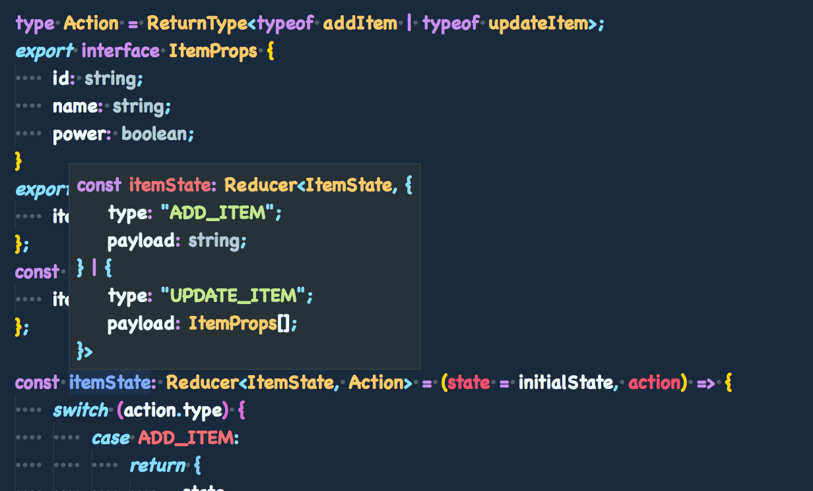
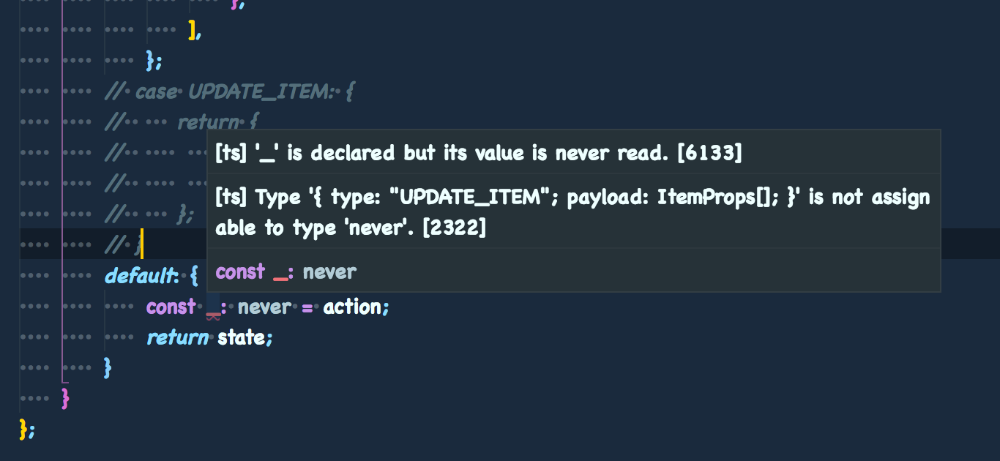

## 入力フォームと Middleware の作成

先ほどのページでは登録された家電の表示と電源の ON/OFF を変更する ItemList を作りました。  
ここでは以下の 2 つを実装します。

-   家電を登録するための入力フォーム
-   リスト化された家電の電源を変更する Middleware

内容は<a href='../HowToRedux/HowToRedux4'>HowToRedux4</a>と<a href='../HowToRedux/HowToRedux5'>HowToRedux5</a>をかけ合わせたものになります。  
formik の実装により、action、middleware、reducer のコードに一部変更があります。
なお、コードの実装内容そのものは HowToRedux のものと同じなので、コードの解説は行いません。

## Component の作成

家電を登録するための入力フォームを作成します。

### AddItem の作成

components 配下に AddItem.tsx を作成し、以下のコードを作成します。

```tsx
// components/AddItem.tsx
import React from 'react';
import { withFormik, InjectedFormikProps } from 'formik';
import * as Yup from 'yup';

type Props = {
    addItemAction: (value: string) => void;
};
type FormikProps = {
    item: string;
};

class AddItem extends React.Component<InjectedFormikProps<Props, FormikProps>> {
    render() {
        const { handleSubmit, handleChange, handleBlur, errors, values } = this.props;
        return (
            <form onSubmit={handleSubmit}>
                <input
                    type="text"
                    name="item"
                    onChange={handleChange}
                    onBlur={handleBlur}
                    value={values.item}
                />
                {errors.item && <span>{errors.item}</span>}
                <button type="submit">追加</button>
            </form>
        );
    }
}
export default withFormik<Props, FormikProps>({
    mapPropsToValues: () => ({
        item: '',
    }),
    validationSchema: () =>
        Yup.object().shape({
            item: Yup.string().required('入力必須です'),
        }),
    handleSubmit: (values, { props, resetForm }) => {
        const { addItemAction } = props;
        addItemAction(values.item);
        resetForm();
    },
    displayName: 'itemForm',
})(AddItem);
```

formik は TypeScript 製なので、基本的にフォームの型定義（FormikProps）を作成して渡すのみで動作するようになります。  
新しいコンポーネントを作成したので、index.ts を変更します。

```ts
// components/index.ts
export { default as ItemList } from './ItemList';
export { default as AddItem } from './AddItem';
```

### formik の型定義

Higher Order Components（以下 HOC）で実装する場合、InjectedFormikProps という型を使います。  
InjectedFormikProps には、formik で扱う際に使う values や errors といったオブジェクトや handleChange や handleSubmit の型定義が含まれています。  
第 1 型引数に Component で扱う props、第 2 型引数にフォームに登録する props を渡すことで型がマージされます。  
HOC の実装部となる withFormik にも同様の型引数を渡すことで、mapPropsToValues や handleSubmit で型推論が機能するようになります。

### ItemList の変更

続いて、家電をリスト表示できるように ItemList を変更し、DisplayState のスタイリングを変更します。
ItemList.tsx を以下のコードに書き直します。

```tsx
// components/ItemList.tsx
import React from 'react';
import styled from 'styled-components';
import Switch from './Switch';
import DisplayState from './DisplayState';
import { ItemProps } from '../reducers/addItem';

type Props = {
    items: ItemProps[];
    changePowerStateAction: (index: number) => () => void;
};

class ItemList extends React.Component<Props> {
    render() {
        const { items, changePowerStateAction } = this.props;
        return (
            <div>
                {items.map(({ id, name, power }, index) => (
                    <List key={id}>
                        <Item>{name}</Item>
                        <DisplayState power={power} />
                        <Switch onClick={changePowerStateAction(index)} />
                    </List>
                ))}
            </div>
        );
    }
}

const List = styled.div`
    width: 100%;
    display: flex;
    color: rgb(100, 100, 100);
    padding-bottom: 1rem;
    margin-bottom: 2rem;
    border-bottom: 1px solid rgb(100, 100, 100);
`;
const Item = styled.div`
    font-size: 3rem;
    width: 30%;
`;

export default ItemList;
```

### DisplayState の変更

```tsx
// components/DisplayState.tsx
import React from 'react';

type Props = {
    power: boolean;
};

class DisplayState extends React.PureComponent<Props> {
    render() {
        return <div style={{ width: '45px' }}>{this.props.power ? 'ON' : 'OFF'}</div>;
    }
}

export default DisplayState;
```

## Container の作成

AddItem 用の Container を作り Redux と接続させます。  
Containers 配下に AddItem.tsx を作成し、下記コードを作成します。

```tsx
// containers/AddItem.tsx
import { connect } from 'react-redux';
import { Dispatch } from 'redux';
import { AddItem } from '../components';
import { addItem } from '../actions';

const mapStateToProps = () => ({});

const mapDispatchToProps = (dispatch: Dispatch) => ({
    addItemAction(value: string) {
        dispatch(addItem(value));
    },
});

export default connect(
    mapStateToProps,
    mapDispatchToProps,
)(AddItem);
```

HowToRedux4 で実装した時とコードが若干異なります。
入力値管理を formik に任せたことで、AddItem は Store から情報を受け取る必要がなくなりました。  
そこで、mapStateToProps は空のオブジェクトを返却する関数に変更しています。

新しい Container を作成したので、index.ts を変更します。

```ts
// containers/index.tsx
export { default as ItemList } from './ItemList';
export { default as AddItem } from './AddItem';
```

### ItemList の変更

受け取る props やアクションの引数に変更があるので、ItemList を下記コードに変更します。

```tsx
// containers/ItemList.tsx
import { connect } from 'react-redux';
import { Dispatch } from 'redux';
import { ItemList } from '../components';
import { changePowerState } from '../actions';
import { Store } from '../reducers';

const mapStateToProps = ({ itemState }: Store) => ({
    items: itemState.items,
});

const mapDispatchToProps = (dispatch: Dispatch) => ({
    changePowerStateAction(index: number) {
        return () => dispatch(changePowerState(index));
    },
});

export default connect(
    mapStateToProps,
    mapDispatchToProps,
)(ItemList);
```

## Action の作成

家電を登録するアクション、家電の電源を変更するアクションをそれぞれ作成します。

### actionTypes の追加

最初にアクション定数を作成します。

```ts
// sctions/actionType.ts
export const CHANGE_POWER_STATE = 'CHANGE_POWER_STATE';
export const ADD_ITEM = 'ADD_ITEM';
export const UPDATE_ITEM = 'UPDATE_ITEM';
```

### actionCreator の作成

actions 配下に addItem.ts を作成し、下記コードを作成します。

```ts
// actions/addItem.ts
import { ADD_ITEM, UPDATE_ITEM } from './actionType';
import { ItemProps } from '../reducers/addItem';

export const addItem = (payload: string) => ({
    type: ADD_ITEM as typeof ADD_ITEM,
    payload,
});

export const updateItem = (payload: ItemProps[]) => ({
    type: UPDATE_ITEM as typeof UPDATE_ITEM,
    payload,
});
```

formik の実装に切り替えたため、新しく UPDATE_ITEM というアクション定数を作成しました。  
こちらは、家電の電源を変更した際に発火するアクションになっています。  
流れとしては、

```
Action(changePowerState) => middleware => Dispatch(updateItem) => reducer
```

を想定して作成しています。

### itemList の変更

changePowerState が電源を変更する index を受け取れるように下記コードに変更します。

```ts
// actions/itemList.ts
import { CHANGE_POWER_STATE } from './actionType';

export const changePowerState = (payload: number) => ({
    type: CHANGE_POWER_STATE as typeof CHANGE_POWER_STATE,
    payload,
});
```

## middleware の実装

家電の電源が変更（changePowerState）された際の middleware を実装します。

### itemList の作成

middlewares 配下に itemList.ts を作成し、下記コードを作成します。

```ts
// middlewares/itemList.js
import { MiddlewareAPI, Dispatch } from 'redux';
import { CHANGE_POWER_STATE } from '../actions/actionType';
import { changePowerState as changePowerStateAction, updateItem } from '../actions';
import { Store } from '../reducers';

type Action = ReturnType<typeof changePowerStateAction>;

const changePowerState = (store: MiddlewareAPI<Dispatch, Store>) => (next: Dispatch) => (
    action: Action,
) => {
    switch (action.type) {
        case CHANGE_POWER_STATE: {
            const { items } = store.getState().itemState;
            const changedPowerItems = items.map((item, index) =>
                index === action.payload ? { ...item, power: !item.power } : item,
            );
            next(updateItem(changedPowerItems));
            break;
        }
        default:
            next(action);
    }
};

export default changePowerState;
```

middleware が受け取るアクションの型は reducer と同じように ReturnType を使います。  
HowToRedux4 では

`next(addItem(changedPowerItems))`

でしたが、ここでは updateItem(changedPowerItems)に変更しています。

#### middleware の型定義

middleware では、関数がそれぞれ受け取る

-   store : MiddlewareAPI<D, S>
-   next : Dispatch
-   action : Action

この 3 つに対して型付けを行います。  
Dispatch は Container で使用した型定義と同じもので、
MiddlewareAPI は、getState と dispatch の 2 つのプロパティを持つ型定義になります。  
第 2 型引数にアプリケーションが持つ Store の型を渡すことで

`store.getState()`

した際に、型補完がきくようになります。

### ルートとなる index.ts の作成

middleware をまとめるため、index.ts を作成して下記コードを作成します。

```ts
// middlewares/index.ts
import { applyMiddleware, Middleware } from 'redux';
import { createLogger } from 'redux-logger';
import changePowerState from './itemList';

const logger: Middleware[] = [];
if (process.env.NODE_ENV !== 'production') {
    logger.push(createLogger());
}

const middlewares = applyMiddleware(changePowerState, ...logger);

export default middlewares;
```

アクションの流れを見ることができるように logger も登録しておきます。  
logger の型定義ですが、Middleware[]と型をつけておりますが、こちらに関しては any[]でも問題ないです。

### 混同しやすい middleware の型定義

redux には Store と Middleware という型がまた別に定義されています。

-   Store : createStore した際に作成される store オブジェクト用の型定義
-   Middleware : middleware 用の型定義だが、不完全で型補完が一部きかない

HowToRedux4 でもチラっと説明しましたが、middleware 内の store は middlewareAPI と呼ばれるものです。  
アプリケーションを作成している時には気づきにくいですが、まったく異なるオブジェクトなので気をつけてください。  
厄介なのが Middleware という型定義で、node_modules/redux/index.d.ts を見てみると

```ts
export interface Middleware<DispatchExt = {}, S = any, D extends Dispatch = Dispatch> {
    (api: MiddlewareAPI<D, S>): (next: Dispatch<AnyAction>) => (action: any) => any;
}
```

このような型付けがされています。
Middleware は 3 つの型引数を受け取ることができるのですが、アクションが any 型になっており、
型引数から操作もできないので型付けができないようになっています。  
一応、実装する middleware 内で直接アクションに型を渡せば型補完がきくようになりますが、コードの見栄えが良くないです。

#### Middleware の型を改良する（非推奨）

この不完全な Middleware の型ですが、作り直すことで綺麗に型付けを行うことができるようになります。  
なお、かなりハック的な行いなので、あらぬバグの温床になったりします。推奨はしません。

```ts
// middlewares/types.ts
import { MiddlewareAPI, Dispatch, AnyAction } from 'redux';

export interface Middleware<
    A extends AnyAction = AnyAction,
    S = any,
    D extends Dispatch = Dispatch
> {
    (api: MiddlewareAPI<D, S>): (next: Dispatch<AnyAction>) => (action: A) => any;
}
```

DispatchExt を削除し、替わりにアクションを受け取れるように変更しました。  
こちらの型を使えば、アクションの型補完もきくようになります。  
なお、DispatchExt は applyMiddleware で使用されているようですが、redux v4.0.1 時点では消してしまっても正常に動きます。  
使用する際は

```ts
import { Dispatch } from 'redux';
import { changePowerState as changePowerStateAction, updateItem } from '../actions';
import { Store } from '../reducers';
import { Middleware } from './types';

type Action = ReturnType<typeof changePowerStateAction>;

const changePowerState: Middleware<Action, Store, Dispatch> = store => next => action => {};
```

とすることで、動作するようになります。

## reducer の作成

登録された家電と変更された家電を更新するために reducer を作成します。  
前回作成した itemList は必要なくなったため、削除します。
そして新たに AddItem.ts を作成し、下記コードを作成します。

```ts
// reducers/addItem.ts
import { Reducer } from 'redux';
import { ADD_ITEM, UPDATE_ITEM } from '../actions/actionType';
import { addItem, updateItem } from '../actions';

type Action = ReturnType<typeof addItem | typeof updateItem>;
export interface ItemProps {
    id: string;
    name: string;
    power: boolean;
}
export type ItemState = {
    items: ItemProps[];
};
const initialState = {
    items: [],
};

const itemState: Reducer<ItemState, Action> = (state = initialState, action) => {
    switch (action.type) {
        case ADD_ITEM:
            return {
                ...state,
                items: [
                    ...state.items,
                    {
                        id: `item-index-of-${state.items.length}`,
                        name: action.payload,
                        power: false,
                    },
                ],
            };
        case UPDATE_ITEM: {
            return {
                ...state,
                items: action.payload,
            };
        }
        default: {
            const _: never = action;
            return state;
        }
    }
};

export default itemState;
```

前回の HowToTypeScript2、そして HowToRedux4 での実装と比べて大きくコードが変わりました。

-   HowToRedux4 からの変更点
    -   middleware で書いていた登録処理が reducer に移動
    -   家電の電源が変更されたアクションの受け口が UPDATE_ITEM に変更
-   HowToTypeScript2 からの変更点
    -   ReturnType が addItem と updateItem の型を持つ union types になった
    -   家電が持つプロパティ一覧、ItemProps の型定義
    -   default 句で never 型にアクションをアサインしている

また、受け取るアクションが 2 つになったことで、前回触れた Tagged Union Types がここで真価を発揮します。  
新しい reducer を作成したので、index.ts を下記コードに変更します。

```ts
// reducers/index.ts
import { combineReducers } from 'redux';
import itemState, { ItemState } from './addItem';

export type Store = {
    itemState: ItemState;
};

const reducers = combineReducers({
    itemState,
});

export default reducers;
```

### Tagged Union Types によるアクションの絞り込み

Tagged Union Types とは、Switch 文でわけられたブロックに対しての各ケースごとの型の絞り込みを行います。  
アクションの絞り混みを行うとは、**actionCreator が返す payload の有無と payload の型定義を判定する**ということになります。  
つまり、ADD_ITEM の payload と UPDATE_ITEM の payload を別々の値として TypeScript のパーサーに解釈させることができます。

<br />


<br />
VSCodeでは、宣言した値や関数にカーソルを合わせることで型を確認することができます。  
作成したitemStateにカーソルを合わせると、同じプロパティ名ですが違う型を持っていることを上記画像で確認することができます。  
string型に対してスプレッドオペレーター（...）を使用することはTypeScriptでは禁止されていますが、
UPDATE_ITEMというケース内ではid, name, powerの3つのプロパティを持つ連想配列であることを判別できているので
スプレッドオペレーターによる代入ができています。  
このTagged Union Typesのキーとなっているのがアクションで定義した

`type: ADD_ITEM as typeof ADD_ITEM`

になります。  
ただの string ではなく、文字列リテラル型にすることで Tagged Union Types で絞り込みができるという理論になっています。

### never 型による未定義アクション漏れの確認

never 型を使うことで、アクションの漏れとタイポを検知することができます。  
Tagged Union Types で絞り込みを行なっているため、この reducer 内では、default 句は未到達コードとして扱われます。  
試しに、case 句の UPDATE_ITEM をコメントアウトしてみます。

<br />


<br />
このように、コード上に赤い波線が引かれ、updateItemの型はnever型である_にアサイン（代入）できませんとエラーがでてきました。
never型にはany型を含めあらゆる型の割り当ては禁止されています。  
actionCreatorには文字列リテラル型のtypeと、string型かItemProps[]型のpayloadが型定義されています。  
それぞれnever型にアサインすることができないし、Tagged Union Typesで絞り込みを行なっているのでエラーにすることができます。

<br />
TypeScriptではこのように、型システムを使うことでJavaScriptではできない型安全で堅牢なコードを書くことができます。  
Reduxでは特にこのreducerが型の恩恵に肖れます。

### reducer 実装時の注意点

Tagged Union Types と never 型を使って reducer を書きましたが、実装する上で注意点が 2 つあります。

-   受け取るアクションが 1 つの場合、never 型が使えない
-   アクションの分割代入ができない

前回のページで never 型を使わなかったことと、action の分割代入を行なわなくなったのはこれが理由です。

## App.ts の変更

作成したコンポーネント等を読み込めるようにします。  
App.tsx を下記コードに変更します。

```tsx
// App.tsx
import React from 'react';
import ReactDom from 'react-dom';
import { createStore } from 'redux';
import { Provider } from 'react-redux';
import redcuers from './reducers';
import middlewares from './middlewares';
import { ItemList, AddItem } from './containers';

const store = createStore(redcuers, middlewares);

// DOM出力
ReactDom.render(
    <Provider store={store}>
        <>
            <AddItem />
            <ItemList />
        </>
    </Provider>,
    document.getElementById('content'),
);
```

作業は以上となります。  
また、HowToTypeScript はこれで終了です。

<br />
素のJavaScriptに比べると、型システムが導入された分複雑になってしまいますが、
それに有り余る恩恵を受けることができます。  
Redux自体はピュアな関数群なので、reducerやmiddlewareに型システムを組み込むことは比較的容易です。  
Flowという選択肢もありますが、React / Reduxの実装にはTypeScriptをおすすめします。
